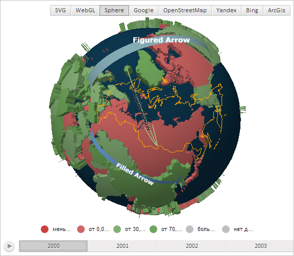

# MapShape.VerticesData

MapShape.VerticesData
-

# MapShape.VerticesData

## Синтаксис

VerticesData: Object;

## Описание

Свойство VerticesData определяет данные вершин области слоя карты.

## Комментарии

Значение свойства устанавливается из JSON и с помощью метода setVerticesData, а возвращается с помощью метода getVerticesData.

## Пример

Для выполнения примера необходимо наличие на html-странице компонента [MapChart](../../../Components/MapChart/MapChart.htm) с наименованием «map» и компонента [ToolBar](dhtmlUi.chm::/Classes/ToolBar/ToolBar.htm) с наименованием «MapType» (см. «[Пример создания компонента MapChart](../../../Components/MapChart/MapChart_Example.htm)»). Также требуется, чтобы была загружена карта с топоосновой Sphere (см. страницу описания свойства [MapChart.AmbientLightValue](../MapChart/MapChart.AmbientLightValue.htm)).

Отобразим для слоя области карты границу, высота точек которой увеличена в 2 раза:

// Получим область слоя карты с идентификатором «RU»
var shape = map.getShape("RU");
// Получим данные о вершинах области
var verticesData = shape.getVerticesData();
// Получим данные о точках границы области
var borders = verticesData.borders;
// Увеличим высоту точек границы в два раза
for (i = 1; i < borders.length; i += 3) {
    if (borders[i]) {
        borders[i] *= 2
    }
};
shape.setVerticesData(verticesData);
// Отобразим границу области слоя карты
shape.setBorder(true, PP.Color.Colors.orange, 1);
// Обновим карту
map.refresh();

В результате выполнения примера была отображена граница области слоя карты. Высота точек, из которых состоит граница, увеличена в 2 раза:

См. также:

[MapShape](MapShape.htm)

		Справочная
		 система на версию 10.9
		 от 18/08/2025,
		 © ООО «ФОРСАЙТ»,
