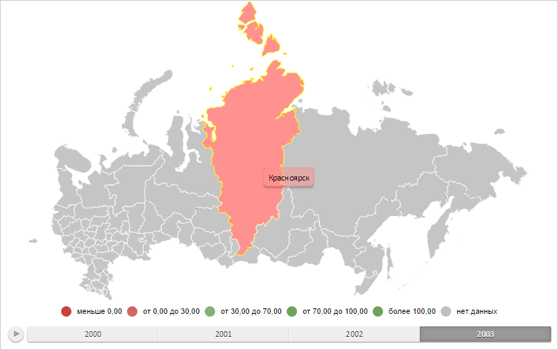

# MapShape.Visual

MapShape.Visual
-

# MapShape.Visual

## Синтаксис

Visual: [PP.AreaVisual](../AreaVisual/AreaVisual.htm);

## Описание

Свойство Visual определяет настройки
 сопоставления данных области слоя карты.

## Комментарии

Значение свойства устанавливается из JSON и с помощью метода setVisual,
 а возвращается с помощью метода getVisual.

## Пример

Для выполнения примера необходимо наличие на html-странице компонента
 [MapChart](../../../Components/MapChart/MapChart.htm) с наименованием
 «map» (см. «[Пример
 создания компонента MapChart](../../../Components/MapChart/MapChart_Example.htm)»). Применим новые настройки для области
 слоя карты с идентификатором «RU-KYA» и отобразим всплывающую подсказку
 для неё:

// Возвращает слой с областями карты
function getWorkLayer() {
    return map.getLayer("Regions");
}
// Возвращает базовый класс территориального показателя карты
function getAreaVisual() {
    return getWorkLayer().getVisual();
}
// Возвращает источник данных
function getDataSource() {
    return map.getDataSources().DataSource0;
}
/* Создаёт объект для работы с настройками
сопоставления данных для территориального показателя */
function createAreaVisual() {
    var areaVisual = {
        ColorMapping: getColorMapping(),
        HeightMapping: getAreaVisual().getHeightMapping(),
        Id: "MapAreaVisual"
    };
    return areaVisual;
}
/* Создаёт настройки сопоставления данных
цвету заливки областей слоя карты */
function getColorMapping() {
    var colorMappings = new PP.DataMapping({
        DataSource: getDataSource(),
        Type: PP.DataMappingType.Scale,
        DimAttributeId: "areaColor0",
        Id: "areaColor0",
        // Определяем шкалу
        Scale: new PP.ScaleBase({
            Items: "#FF705B #FF9191 #C3D66C #6BBC80 #82BAB6 Transparent",
            NoData: "Gray",
            TypeArguments: "Brush",
            Id: "MapScale0",
            Values: "0 30 70 100"
        })
    })
    return colorMappings;
}
// Создаёт всплывающую подсказку
function createToolTip() {
    var toolTip = new PP.Ui.ChartTooltipBase({
        HoverMode: PP.HoverMode.Click,
        MaskText: {
            IsAuto: true,
            Value: "{%Name}"
        }
    });
    return toolTip;
}
// Создаёт пузырьковый показатель
function createMapShape() {
    var mapShape = getWorkLayer().getShape("RU-KYA");
    mapShape.setVisual(createAreaVisual());
    mapShape.setValue("Красноярск");
    mapShape.setToolTip(createToolTip());
    var domNode = mapShape.getDomNode();
    domNode.setAttribute("stroke", PP.Color.Colors.yellow);
    mapShape.setDomNode(domNode);
    return mapShape;
}
// Отрисовывает расшифровку территорий карты
function drawMapShape(mapShape) {
    if (mapShape.getDomNode() == null) {
        mapShape.draw();
    }
    var shapes = getWorkLayer().getShapes();
    shapes[mapShape.getId()] = mapShape;
    // Обновляем карту
    map.refresh();
}
// Отрисовывает всплывающую подсказку
function drawToolTip(mapShape) {
    // Определяем цвет заливки всплывающей подсказки
    var toolTipColor = mapShape.getToolTipColor();
    mapShape.getToolTip().setBackground(new PP.SolidColorBrush({
        Color: toolTipColor,
        Opacity: 0.5
    }));
    mapShape.getToolTip().setFont(new PP.Font());
    // Отображаем всплывающую подсказку
    mapShape.toggleTooltip(mapShape.getCenter().getX(), mapShape.getCenter().getY());
}
// Выводит информацию о слое области карты
function printShapeInfo(mapShape) {
    if (mapShape.getIsRendered()) {
        console.log("Область слоя карты «%s» успешно отрисована", mapShape.getId());
    }
    console.log("Текущий цвет заливки области слоя карты «%s»: %s", mapShape.getId(), mapShape.getCurrentBrush().getColor());
    if (mapShape.getIsSettingsCreated()) {
        console.log("Область слоя карты была создана на основе настроек пользователя");
    } else {
        console.log("Область слоя карты была создана на основе настроек, полученных при разборе топоосновы");
    }
    console.log("Область слоя карты «%s» %sпрозрачна", mapShape.getId(), (mapShape.isOpaque() ? "не " : ""));
}
// Выводит информацию, отображаемую в всплывающей подсказке
function printToolTipInfo(mapShape) {
    console.log("Всплывающая подсказка отображена для области слоя карты «%s»", mapShape.getToolTipValues().Name);
}
// Получаем область слоя карты
var mapShape = createMapShape();
// Отрисовываем данную область
drawMapShape(mapShape);
// Отображаем всплывающую подсказку
drawToolTip(mapShape);
// Выводим информацию о слое области карты
printShapeInfo(mapShape);
// Выводим информацию, отображаемую в всплывающей подсказке
printToolTipInfo(mapShape);
В результате выполнения примера для области слоя карты с идентификатором
 «RU-KYA» были установлены новые настройки сопоставления данных, задано
 значение «Красноярск», граница области окрашена в жёлтый цвет, отображена
 всплывающая подсказка:

В консоли браузера была выведена информация об области слоя карты с
 идентификатором «RU-KYA» и всплывающей подсказке:

Область слоя карты «RU-KYA» успешно отрисована

Текущий цвет заливки области слоя карты «RU-KYA»:
 #FF9191

Область слоя карты была создана на основе настроек,
 полученных при разборе топоосновы

Область слоя карты «RU-KYA» не прозрачна

Всплывающая подсказка отображена для области слоя
 карты «Красноярск»

См. также:

[MapShape](MapShape.htm)

		Справочная
		 система на версию 10.9
		 от 18/08/2025,
		 © ООО «ФОРСАЙТ»,
