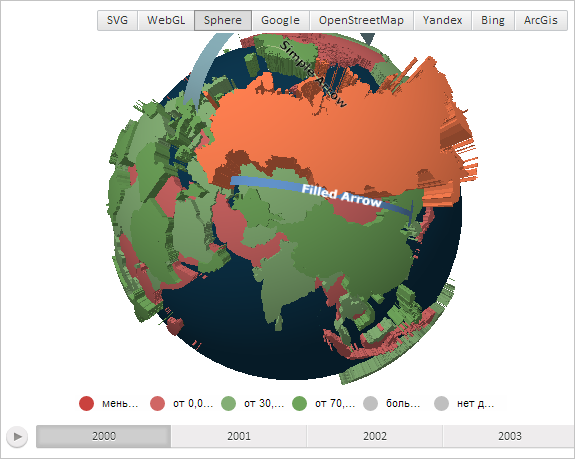

# MapShape.ZValue

MapShape.ZValue
-

# MapShape.ZValue

## Синтаксис

ZValue: Number;

## Описание

Свойство ZValue определяет высоту
 области слоя карты.

## Комментарии

Значение свойства устанавливается из JSON и с помощью метода setZValue,
 а возвращается с помощью метода getZValue.

## Пример

Для выполнения примера необходимо наличие на html-странице компонента
 [MapChart](../../../Components/MapChart/MapChart.htm) с наименованием
 «map» и компонента [ToolBar](dhtmlUi.chm::/Classes/ToolBar/ToolBar.htm) с наименованием
 «MapType» (см. «[Пример
 создания компонента MapChart](../../../Components/MapChart/MapChart_Example.htm)»). Также требуется, чтобы была загружена
 карта с топоосновой Sphere (см. страницу описания свойства [MapChart.AmbientLightValue](../MapChart/MapChart.AmbientLightValue.htm)).

Отрисуем область слоя карты, имеющую идентификатор «RU», с заливкой
 кораллового цвета и высотой, равной 0,3:

// Получим область слоя карты с идентификатором «RU»
var shape = map.getShape("RU");
// Установим высоту области, равную 0,3
shape.setZValue(-0.3);
// Отрисуем область слоя карты, используя коралловый цвет заливки
shape.draw(PP.Color.Colors.coral);
// Обновим карту
map.refresh();
В результате выполнения примера на карте была отрисована область, имеющая
 идентификатор «RU» с заливкой кораллового цвета и высотой, равной 0,3:

См. также:

[MapShape](MapShape.htm)

		Справочная
		 система на версию 10.9
		 от 18/08/2025,
		 © ООО «ФОРСАЙТ»,
