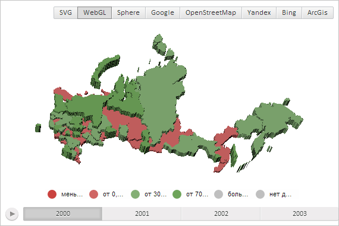

# MapShape.addVerticesData

MapShape.addVerticesData
-

# MapShape.addVerticesData

## Синтаксис

addVerticesData(data: Object);

## Параметры

data. Данные вершин области слоя карты.

## Описание

Метод addVerticesData добавляет новые данные вершин для области слоя карты.

## Комментарии

Метод работает в картах с трёхмерной топоосновой, например, с WebGL и Sphere.

## Пример

Для выполнения примера необходимо наличие на html-странице компонента [MapChart](../../../Components/MapChart/MapChart.htm) с наименованием «map» (см. «[Пример создания компонента MapChart](../../../Components/MapChart/MapChart_Example.htm)»). Также требуется, чтобы была загружена карта с топоосновой WebGL (см. страницу описания свойства [MapChart.TopoNormalization](../MapChart/MapChart.TopoNormalization.htm)).

Удалим область слоя карты с идентификатором «RU-SA»:

// Сохраним данные вершин области слоя карты с переменной verticesData
var verticesData = map.getShape("RU-SA").getVerticesData();
// Получим слой карты, содержащий области
var layer = map.getLayer("Regions");
// Получим коллекцию областей слоя карты
var shapes = layer.getShapes();
// Удалим область слоя карты с идентфикатором «RU-SA»
delete shapes["RU-SA"];
// Перерисуем карту
map.draw();

В результате выполнения примера была удалена область слоя карты с идентификатором «RU-SA»:

Теперь добавим обратно на карту область с идентификатором «RU-SA»:

// Определим настройки для новой области слоя карты
var settings = {
    Id: "RU-SA",
    Chart: map,
    ParentLayer: layer
};
// Добавим область слоя карты с идентификатором «RU-SA»
layer.getShapes()["RU-SA"] = new PP.MapShape(settings);
var newShape = layer.getShapes()["RU-SA"];
// Добавим данные вершин
newShape.addVerticesData(verticesData);
// Соединим данные вершин, добавленные в предыдущем методе
newShape.joinVerticesData();
// Вычислим прямоугольную область, ограничивающую область слоя карты
newShape._calcBoundingBox();
// Отрисум добавленную область слоя карты
newShape.render3d();

В результате выполнения примера на карту была добавлена область с идентификатором «RU-SA».

См. также:

[MapShape](MapShape.htm)

		Справочная
		 система на версию 10.9
		 от 18/08/2025,
		 © ООО «ФОРСАЙТ»,
