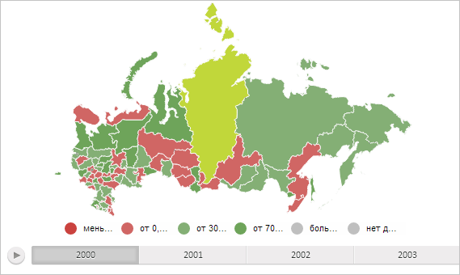

# MapShape.animate

MapShape.animate
-

**

# MapShape.animate

## Синтаксис

animate(step: Number);

## Параметры

*step.* Доля анимации для воспроизведения. Параметр может принимать числовое значение от 0 до 1 включительно.

## Описание

Метод animate** воспроизводит анимацию области слоя карты.

## Пример

Для выполнения примера необходимо наличие на html-странице компонента [MapChart](../../../Components/MapChart/MapChart.htm) с наименованием «map» (см. «[Пример создания компонента MapChart](../../../Components/MapChart/MapChart_Example.htm)»). Воспроизведём для области слоя карты с идентификатором «RU-KYA» половину от всего процесса анимации, заключающегося в переходе от начального жёлтого цвета заливки к исходному зелёному:

// Получим область слоя карты с идентификатором «RU-KYA»
var shape = map.getShape("RU-KYA");
// Установим для заливки области в качестве начального жёлтый цвет
shape._prevColor = PP.Color.Colors.yellow;
// Воспроизведём анимацию на 50%
shape.animate(0.5);

В результате выполнения примера для области слоя карты с идентификатором «RU-KYA» была воспроизведена половина от всего процесса анимации перехода от начального жёлтого цвета заливки к исходному зелёному:

См. также:

[MapShape](MapShape.htm)

		Справочная
		 система на версию 10.9
		 от 18/08/2025,
		 © ООО «ФОРСАЙТ»,
