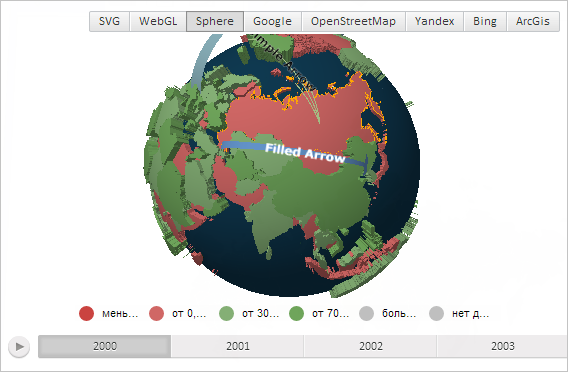

# MapShape.applyEffect3d

MapShape.applyEffect3d
-

# MapShape.applyEffect3d

## Синтаксис

applyEffect3d(doApply: Boolean);

## Параметры

doApply. Признак применения эффекта для области слоя трёхмерной карты. Если параметр равен значению true, то для области трёхмерной карты будет применён эффект, иначе (по умолчанию) - не будет.

## Описание

Метод applyEffect3d применят эффект для области слоя трёхмерной карты.

## Пример

Для выполнения примера необходимо наличие на html-странице компонента [MapChart](../../../Components/MapChart/MapChart.htm) с наименованием «map» и компонента [ToolBar](dhtmlUi.chm::/Classes/ToolBar/ToolBar.htm) с наименованием «MapType» (см. «[Пример создания компонента MapChart](../../../Components/MapChart/MapChart_Example.htm)»). Также требуется, чтобы была загружена карта с топоосновой Sphere (см. страницу описания свойства [MapChart.AmbientLightValue](../MapChart/MapChart.AmbientLightValue.htm)).

Выполним эффект для области слоя карты с идентификатором «RU»:

// Получим область слоя карты с идентификатором «RU»
var shape = map.getShape("RU");
// Применим эффект для области слоя карты
shape.applyEffect3d(true);
// Перерисуем карту
map.draw();

В результате выполнения примера будет подсвечена граница области слоя карты с идентификатором «RU»:

См. также:

[MapShape](MapShape.htm)

		Справочная
		 система на версию 10.9
		 от 18/08/2025,
		 © ООО «ФОРСАЙТ»,
