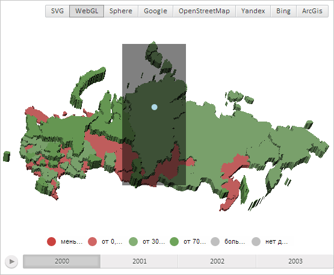

# MapShape.getBoundingBox

MapShape.getBoundingBox
-

# MapShape.getBoundingBox

## Синтаксис

getBoundingBox();

## Описание

Метод getBoundingBox возвращает куб, ограничивающий область слоя трёхмерной карты.

## Комментарии

Метод возвращает значение типа PP.Box.

## Пример

Для выполнения примера необходимо наличие на html-странице компонента [MapChart](../../../Components/MapChart/MapChart.htm) с наименованием «map» (см. «[Пример создания компонента MapChart](../../../Components/MapChart/MapChart_Example.htm)»). Также требуется, чтобы была загружена карта с топоосновой WebGL (см. страницу описания свойства [MapChart.TopoNormalization](../MapChart/MapChart.TopoNormalization.htm)).

Нарисуем прямоугольник, ограничивающий область слоя трёхмерной карты с идентификатором «RU-KYA», и круг в центре данной области:

// Получим область слоя карты с идентификатором «RU-KYA»
var shape = map.getShape("RU-KYA");
// Получим куб, ограничивающий область слоя карты
var box = shape.getBoundingBox();
// Получим экранные координаты левой верхней точки куба
var vector1 = new PP.Vector3(box.getLeft(), box.getBottom() + box.getHeight(), box.getFar());
var point1 = map.sceneToScreen(vector1);
// Получим экранные координаты правой нижней точки куба
var vector2 = new PP.Vector3(box.getLeft() + box.getWidth(), box.getBottom(), box.getFar());
var point2 = map.sceneToScreen(vector2);
// Создадим прямоугольник, ограничивающий область слоя карты
var rect = PP.SVG.rect(map.getDomNode().getElementsByTagName("svg")[0]);
PP.SVG.setAttr(rect, {
    'x': point1.getX(),
    'y': point1.getY(),
    'width': point2.getX() - point1.getX(),
    'height': point2.getY() - point1.getY(),
    'opacity': 0.5
});
// Получим центральную точку области слоя карты
var center = shape.getPoint(0.5, 0.5);
// Получим экранные координаты центральной точки куба
var vector3 = new PP.Vector3(center.getX(), center.getY(), center.getZ());
var point3 = map.sceneToScreen(vector3);
// Нарисуем круг с центром в данной точке
var circle = PP.SVG.circle(map.getDomNode().getElementsByTagName("svg")[0]);
PP.SVG.setAttr(circle, {
    'cx': point3.getX(),
    'cy': point3.getY(),
    'r': 5,
    'fill': PP.Color.Colors.lightblue
});

В результате выполнения примера был нарисован прямоугольник, ограничивающий область слоя трёхмерной карты с идентификатором «RU-KYA», и круг в центре данной области:

См. также:

[MapShape](MapShape.htm)

		Справочная
		 система на версию 10.9
		 от 18/08/2025,
		 © ООО «ФОРСАЙТ»,
