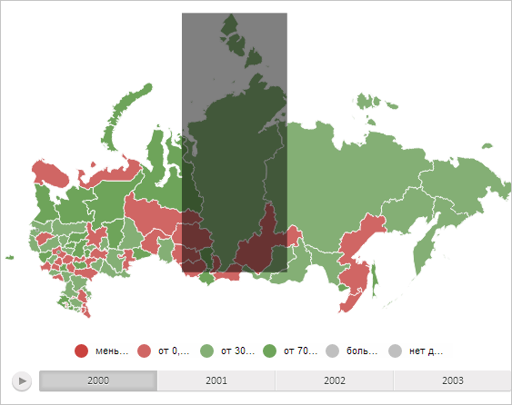

# MapShape.getBoundsRec

MapShape.getBoundsRec
-

# MapShape.getBoundsRec

## Синтаксис

getBoundsRec();

## Описание

Метод getBoundsRec возвращает прямоугольную область, ограничивающую область слоя карты.

## Комментарии

Метод возвращает JSON-объект.

## Пример

Для выполнения примера необходимо наличие на html-странице компонента [MapChart](../../../Components/MapChart/MapChart.htm) с наименованием «map» (см. «[Пример создания компонента MapChart](../../../Components/MapChart/MapChart_Example.htm)»). Нарисуем прямоугольник, ограничивающий область слоя карты с идентификатором «RU-KYA»:

// Получим область слоя карты с идентификатором «RU-KYA»
var shape = map.getShape("RU-KYA");
// Получим прямоугольную область, ограничивающую область слоя карты
var bounds = shape.getBoundsRect();
// Нарисуем прямоугольник, ограничивающий данную область
var rect = PP.SVG.rect(shape.getParentLayer().getDomNode());
PP.SVG.setAttr(rect, {
    'x': bounds.getLeft(),
    'y': bounds.getTop(),
    'width': bounds.getWidth(),
    'height': bounds.getHeight(),
    'opacity': 0.5
});

В результате выполнения примера был нарисован прямоугольник, ограничивающий область слоя карты с идентификатором «RU-KYA»:

См. также:

[MapShape](MapShape.htm)

		Справочная
		 система на версию 10.9
		 от 18/08/2025,
		 © ООО «ФОРСАЙТ»,
