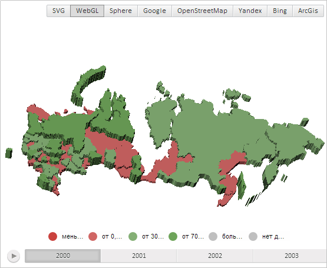

# MapShape.normalize3d

MapShape.normalize3d
-

# MapShape.normalize3d

## Синтаксис

normalize3d(normData: Object);

## Параметры

normData. Данные нормализации.

## Описание

Метод normalize3d нормализует область слоя трёхмерной карты.

## Пример

Для выполнения примера необходимо наличие на html-странице компонента [MapChart](../../../Components/MapChart/MapChart.htm) с наименованием «map» (см. «[Пример создания компонента MapChart](../../../Components/MapChart/MapChart_Example.htm)»). Также требуется, чтобы была загружена карта с топоосновой WebGL (см. страницу описания свойства [MapChart.TopoNormalization](../MapChart/MapChart.TopoNormalization.htm)).

Установим для области слоя трёхмерной карты с идентификатором «RU-KYA» коэффициент нормализации, равный 0,5:

// Получим область слоя карты с идентификатором «RU»
var shape = map.getShape("RU-KYA");
// Определим настройки нормализации области
var normData = {
    norm: 0.5, // Коэффициент нормализации
    offsetx: 0, // Отступ по оси X
    offsety: 0, // Отступ по оси Y
    offsetz: 0 // Отступ по оси Z
};
// Нормализуем область слоя трёхмерной карты
shape.normalize3d(normData);
// Область слоя карты должна быть перерисована
shape._mustRedraw = true;
// Обновим карту
map.refresh();

В результате выполнения примера измерения области трёхмерной карты с идентификатором «RU-KYA» по всем осям были уменьшены в 2 раза:

См. также:

[MapShape](MapShape.htm)

		Справочная
		 система на версию 10.9
		 от 18/08/2025,
		 © ООО «ФОРСАЙТ»,
