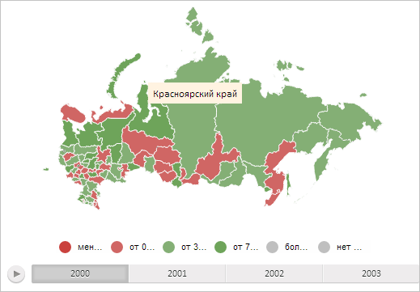

# MapShape.rebuildLabel

MapShape.rebuildLabel
-

# MapShape.rebuildLabel

## Синтаксис

rebuildLabel();

## Описание

Метод rebuildLabel перерисовывает метку для области слоя карты.

## Пример

Для выполнения примера необходимо наличие на html-странице компонента [MapChart](../../../Components/MapChart/MapChart.htm) с наименованием «map» (см. «[Пример создания компонента MapChart](../../../Components/MapChart/MapChart_Example.htm)»). Нарисуем метку для области слоя карты с идентификатором «RU-KYA». Затем уменьшим масштаб карты, обновив расположение созданной метки:

// Получим область слоя карты с идентификатором «RU»
// Получим область слоя карты с идентификатором «RU»
var shape = map.getShape("RU-KYA");
// Разрешим отображение всплывающей подсказки
shape._tooltipOn = true;
// Получим прямоугольную область, ограничивающую область слоя карты
var bounds = shape.getBoundsRect();
// Определим отступы метки от левого и верхнего края карты
var labelLeft = bounds.getLeft() + bounds.getWidth() / 4 +
    (map.getWidth() - map.getTopobaseSize().width) / 2;
var labelTop = bounds.getTop() + bounds.getHeight() / 2 +
    (map.getHeight() - map.getTopobaseSize().height) / 2;
// Создадим метку
var label = new PP.MapLabel({
    Chart: map,
    MaskText: "{%Name}", // Маска текста
    Left: labelLeft,
    Top: labelTop,
});
// Установим метку для области слоя карты
shape.setLabel(label);
// Перерисуем метку
shape.rebuildLabel(label);
// Определим центр карты
var pointZoom = new PP.Point(map.getWidth() / 2, map.getHeight() / 2);
// Уменьшим масштаб карты в 2 раза
map.setScale(0.5, pointZoom, 0, 0);
// Пометим, что для области слоя данных установлена метка
shape._labelOn = true;
// Установим первоначальный центр области слоя карты для обновления расположения метки
shape._labelOrigX = bounds.getLeft() + bounds.getWidth() / 2;
shape._labelOrigY = bounds.getTop() + bounds.getHeight() / 2;
// Обновим расположение метки
shape.updateLabelPosition();

В результате выполнения примера для области слоя карты с идентификатором «RU-KYA» была нарисована метка с текстом, содержащим наименование данной области. После уменьшения масштаба карты в 2 раза расположение метки было обновлено:

См. также:

[MapShape](MapShape.htm)

		Справочная
		 система на версию 10.9
		 от 18/08/2025,
		 © ООО «ФОРСАЙТ»,
