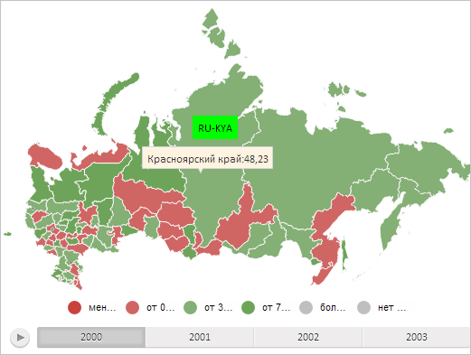

# MapShape.toggleLabel

MapShape.toggleLabel
-

# MapShape.toggleLabel

## Синтаксис

toggleLabel(show: Boolean, _noRedraw: Boolean);

## Параметры

show. Boolean. Признак отображения.
 Необязательный параметр.

_noRedraw. Boolean. При значении true
 подпись данных не будет перерисована. Необязательный параметр.

## Описание

Метод toggleLabel отображает
 и скрывает подпись данных для области слоя карты попеременно после каждого
 вызова.

## Комментарии

При использовании параметра show
 метод устанавливает признак отображения подписи данных.

## Пример

Для выполнения примера необходимо наличие на html-странице компонента
 [MapChart](../../../Components/MapChart/MapChart.htm) с наименованием
 «map» (см. «[Пример
 создания компонента MapChart](../../../Components/MapChart/MapChart_Example.htm)»). Отобразим для области слоя карты с
 идентификатором «RU-KYA» подпись данных и всплывающую подсказку:

// Получим область слоя карты с идентификатором «RU»
var shape = map.getShape("RU-KYA");
// Создадим подпись данных
var label = new PP.MapLabel({
    Chart: map,
    MaskText: "RU-KYA" // Маска текста
});
// Установим для подписи данных заливку зелёного цвета
label.setBackground(new PP.SolidColorBrush({
    Color: "#00FF00"
}));
// Установим подпись данных для области слоя карты
shape.setLabel(label);
// Отобразим подпись данных
shape.toggleLabel();
// Получим прямоугольную область, ограничивающую область слоя карты
var bounds = shape.getBoundsRect();
// Определим для всплывающей подсказки отступы от левого и верхнего края карты
var toolTipLeft = bounds.getLeft() + bounds.getWidth() / 2 +
    (map.getWidth() - map.getTopobaseSize().width) / 2;
var toolTipTop = bounds.getTop() + bounds.getHeight() / 1.75 +
    (map.getHeight() - map.getTopobaseSize().height) / 2;
// Отобразим всплывающую подсказку
shape.toggleTooltip(toolTipLeft, toolTipTop);
В результате выполнения примера для области слоя карты с идентификатором
 «RU-KYA» была отображена подпись данных с заливкой зелёного цвета и с
 текстом, содержащим идентификатор области, и всплывающая подсказка:

После повторного выполнения примера подпись данных и всплывающая подсказка
 будут скрыты.

См. также:

[MapShape](MapShape.htm)

		Справочная
		 система на версию 10.9
		 от 18/08/2025,
		 © ООО «ФОРСАЙТ»,
