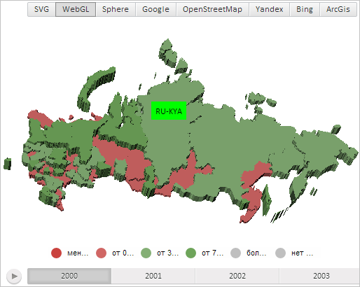

# MapShape.toggleLabel3d

MapShape.toggleLabel3d
-

# MapShape.toggleLabel3d

## Синтаксис

toggleLabel3d(vec: PP.Vector3);

## Параметры

vec. Координаты расположения
 подписи данных в трёхмерной карте.

## Описание

Метод toggleLabel3d отображает
 и скрывает подпись данных для области слоя трёхмерной карты попеременно
 после каждого вызова.

## Пример

Для выполнения примера необходимо наличие на html-странице компонента
 [MapChart](../../../Components/MapChart/MapChart.htm) с наименованием
 «map» (см. «[Пример
 создания компонента MapChart](../../../Components/MapChart/MapChart_Example.htm)»). Также требуется, чтобы была загружена
 карта с топоосновой WebGL (см. страницу описания свойства [MapChart.TopoNormalization](../MapChart/MapChart.TopoNormalization.htm)).

Отобразим подпись данных для области слоя трёхмерной карты с идентификатором
 «RU-KYA»:

// Получим область слоя карты с идентификатором «RU-KYA»
var shape = map.getShape("RU-KYA");
// Создадим подпись данных
var label = new PP.MapLabel({
    Chart: map,
    MaskText: "RU-KYA" // Маска текста
});
// Установим для подписи данных заливку зелёного цвета
label.setBackground(new PP.SolidColorBrush({
    Color: "#00FF00"
}));
// Установим подпись данных для области слоя карты
shape.setLabel(label);
// Отобразим подпись данных для области слоя трёхмерной карты
shape.toggleLabel3d(shape.getCenter());
// Обновим расположение подписи данных
shape.updateLabelPosition3d();
В результате выполнения примера для области слоя трёхмерной карты с
 идентификатором «RU-KYA» была отображена подпись данных с заливкой зелёного
 цвета и с текстом, содержащим идентификатор области:

После повторного выполнения примера подпись данных будет скрыта.

См. также:

[MapShape](MapShape.htm)

		Справочная
		 система на версию 10.9
		 от 18/08/2025,
		 © ООО «ФОРСАЙТ»,
