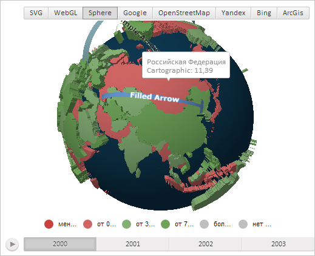

# MapShape.updateTooltipPosition3d

MapShape.updateTooltipPosition3d
-

# MapShape.updateTooltipPosition3d

## Синтаксис

updateTooltipPosition3d();

## Описание

Метод updateTooltipPosition3d обновляет расположение всплывающей подсказки для области слоя трёхмерной карты.

## Пример

Для выполнения примера необходимо наличие на html-странице компонента [MapChart](../../../Components/MapChart/MapChart.htm) с наименованием «map» и компонента [ToolBar](dhtmlUi.chm::/Classes/ToolBar/ToolBar.htm) с наименованием «MapType» (см. «[Пример создания компонента MapChart](../../../Components/MapChart/MapChart_Example.htm)»). Также требуется, чтобы была загружена карта с топоосновой Sphere (см. страницу описания свойства [MapChart.AmbientLightValue](../MapChart/MapChart.AmbientLightValue.htm)).

Нарисуем всплывающую подсказу для области слоя трёхмерной карты с идентификатором «RU»:

// Получим область слоя карты с идентификатором «RU»
var shape = map.getShape("RU");
// Разрешим отображение всплывающей подсказки
shape._tooltipOn = true;
// Создадим новую всплывающую подсказку
var toolTip = new PP.MapToolTip({
    Chart: map
});
// Установим подсказку для области слоя карты
shape.setToolTip(toolTip);
// Получим настройки для подсказки
var vals = map.getTooltipValues(shape, "Нет данных");
// Отрисуем созданную подсказку
toolTip.draw(map.getLayer("Regions"), map.getToolTipLayer(), vals);
// Определим расположение всплывающей подсказки
var vec = shape.getCenter();
var cx = Math.sqrt(vec.dot(vec));
shape._tooltipRelX = Math.atan2(vec.getX(), vec.getZ());
shape._tooltipRelY = Math.asin(vec.getY() / cx);
// Обновим расположение подсказки
shape.updateTooltipPosition3d();

В результате выполнения примера для области слоя трёхмерной карты с идентификатором «RU» была отображена всплывающая подсказка:

См. также:

[MapShape](MapShape.htm)

		Справочная
		 система на версию 10.9
		 от 18/08/2025,
		 © ООО «ФОРСАЙТ»,
