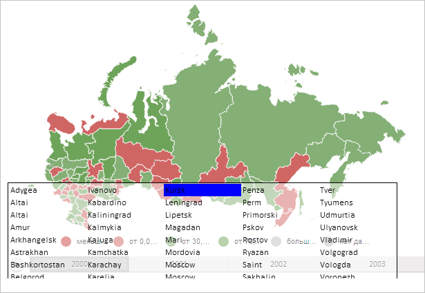

# MapShape.updateTranscript

MapShape.updateTranscript
-

# MapShape.updateTranscript

## Синтаксис

updateTranscript();

## Описание

Метод updateTranscript подсвечивает элемент расшифровки для заданной области слоя карты.

## Пример

Для выполнения примера необходимо наличие на html-странице компонента [MapChart](../../../Components/MapChart/MapChart.htm) с наименованием «map» (см. «[Пример создания компонента MapChart](../../../Components/MapChart/MapChart_Example.htm)»). Отобразим расшифровку областей слоя карты и выделим в ней элемент, соответствующий области с идентификатором «RU-KRS»:

// Получим расшифровку областей слоя карты
var transcript = map.getMapTerritoryTranscript();
// Отобразим расшифровку
transcript.setIsVisible(true);
// Получим область слоя карты с идентификатором «RU-KRS»
var shape = map.getShape("RU-KRS");
// Подсветим элемент расшифровки, соответствующий данной области
shape.updateTranscript(true);

В результате выполнения примера была отображена расшифровка областей слоя карты, в которой был выделен элемент, соответствующий области с идентификатором «RU-KRS»:

См. также:

[MapShape](MapShape.htm)

		Справочная
		 система на версию 10.9
		 от 18/08/2025,
		 © ООО «ФОРСАЙТ»,
