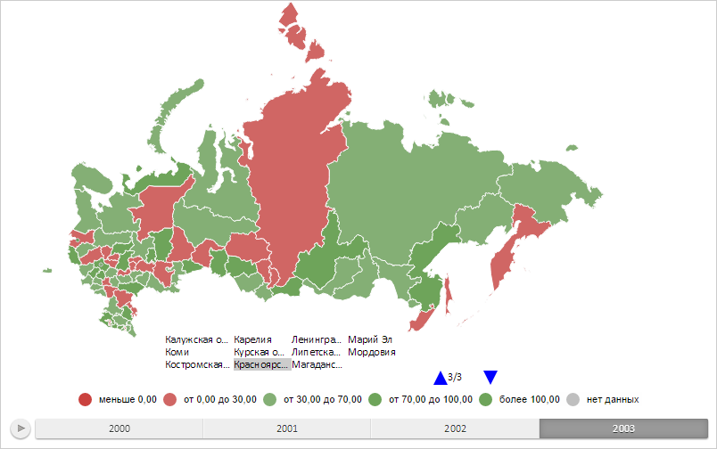

# MapTerritoryTranscript.Chart

MapTerritoryTranscript.Chart
-

# MapTerritoryTranscript.Chart

## Синтаксис

Chart: [PP.MapChart](../MapChart/MapChart.htm);

## Описание

Свойство Chart определяет карту,
 для территорий которой создана расшифровка.

## Комментарии

Значение свойства устанавливается из JSON и с помощью метода setChart,
 а возвращается с помощью метода getChart.

## Пример

Для выполнения примера необходимо наличие на html-странице компонента
 [MapChart](../../../Components/MapChart/MapChart.htm) с наименованием
 «map» (см. «[Пример
 создания компонента MapChart](../../../Components/MapChart/MapChart_Example.htm)»). Создадим расшифровку территорий карты,
 отобразим её последнюю страницу и подсветим элемент, соответствующий области
 слоя карты с идентификатором «RU-KYA»:

// Возвращает слой с областями карты
function getWorkLayer() {
    return map.getLayer("Regions");
}
// Возвращает количество областей слоя карты
function getShapesCount() {
    var count = 0;
    for (var i in getWorkLayer().getShapes()) {
        count++;
    }
    return count;
}
// Возвращает область слоя карты с указанным идентификатором
function getShape(shapeId) {
    return getWorkLayer().getParentLayer().getShape(shapeId);
}
// Создаёт расшифровку территорий карты
function createMapTerritoryTranscript() {
    var mapTerritoryTranscript = new PP.MapTerritoryTranscript({
        CellSpacing: 3, // Отступ элементов
        Chart: map, // Карта, для территорий которой создаём расшифровку
        ParentLayer: getWorkLayer(), // Слой, из которого берём области карты
        MaxItemCount: getShapesCount() / 2, // Максимальное количество элементов
        ItemsOrder: PP.Ui.LegendItemsOrder.TopToBottomByPages, // Порядок следования элементов
        PageMode: PP.Ui.LegendPageMode.MultiplePages // Используем многостраничный режим
    });
    return mapTerritoryTranscript;
}
// Отрисовывает расшифровку территорий карты
function drawMapTerritoryTranscript(mapTerritoryTranscript) {
    var freeArea = new PP.Rect({
        Left: 150,
        Top: 280,
        Width: 450,
        Height: 150
    });
    // Отрисовывает расшифровку
    mapTerritoryTranscript.draw(freeArea, map.getDomNode());
    // Уменьшаем масштаб карты
    map.setScale(0.75);
}
// Создаём расшифровку территорий карты
var mapTerritoryTranscript = createMapTerritoryTranscript();
// Отрисовываем расшифровку территорий
drawMapTerritoryTranscript(mapTerritoryTranscript);
// Отображаем последнюю страницу в расшифровке
mapTerritoryTranscript.setCurrentPage(mapTerritoryTranscript.getPagesCount() - 1);
// Подсвечиваем в расшифровке территорий область слоя карты с идентификатором «RU-KYA»
mapTerritoryTranscript.highlight(getShape("RU-KYA"), true);
В результате выполнения примера была создана расшифровка территорий
 карты, отображена её последняя страница, подсвечен элемент, соответствующий
 области слоя карты с идентификатором «RU-KYA»:

См. также:

[MapTerritoryTranscript](MapTerritoryTranscript.htm)

		Справочная
		 система на версию 10.9
		 от 18/08/2025,
		 © ООО «ФОРСАЙТ»,
