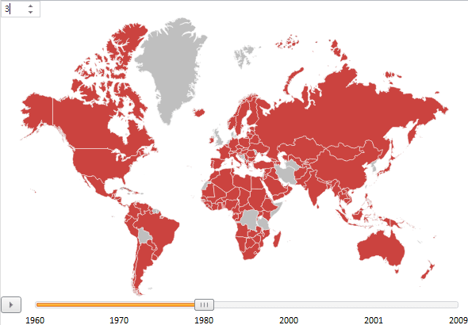

# MapTimeline.CurrentStep

MapTimeline.CurrentStep
-

# MapTimeline.CurrentStep

## Синтаксис

CurrentStep:

## Описание

Свойство CurrentStep определяет
 текущий шаг временной линии.

## Комментарии

При смене шага будет меняться заливка территорий.

Нумерация шагов начинается с 0.

## Пример

Для выполнения примера предполагается наличие на странице компонента
 [MapChart](../../../Components/MapChart/MapChart.htm) с наименованием
 «map» (см. «[Размещение
 карты на HTML странице](../../../Components/MapChart/HTML_layout.htm)»), для которого настроена временная линия (см.
 «[Пример
 настройки временной линии](../../../Components/MapChart/xml_specification/MapChart/MapTimeline/TimeLine_exmpl.htm)»). Добавим [числовой
 редактор](dhtmlUi.chm::/Components/NumberEdit/NumberEdit.htm), значения которого будут определять номер текущего шага:

var numbers
 = new PP.Ui.NumberEdit(

{

    Width: 50,

    Height: 30,

    ParentNode: document.getElementById("div1"),

    AfterValueChange:
 function (sender, args)

    {

        var
 tl = map.getTimeline()

        tl.setCurrentStep(numbers.getValue()
 - 1)

    }

});

После выполнения примера будет добавлен числовой редактор. Чтобы изменить
 текущий шаг временной линии, установите соответствующее значение в редактор:

См. также:

[MapTimeline](MapTimeline.htm)

		Справочная
		 система на версию 10.9
		 от 18/08/2025,
		 © ООО «ФОРСАЙТ»,
