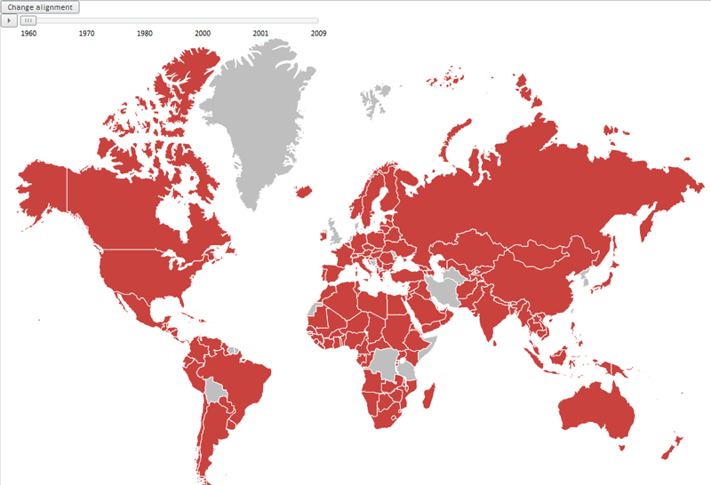

# MapTimeline.applyAlignment

MapTimeline.applyAlignment
-

# MapTimeline.applyAlignment

## Синтаксис

applyAlignment ()

## Описание

Метод applyAlignment применяет настройки расположения временной линии по вертикали и горизонтали.

## Комментарии

Расположения временной линии по вертикали и горизонтали может задаваться в файле с JSON-настройками карты. Для этого используются атрибуты элемента [MapTimeline](../../../Components/MapChart/xml_specification/MapChart/MapTimeline/MapTimeline_element.htm) VerticalAlignment и HorizontalAlignment. По умолчанию временная линия располагается по центру снизу.

## Пример

Для выполнения примера предполагается наличие на странице компонента [MapChart](../../../Components/MapChart/MapChart.htm) с наименованием «map» (см. «[Размещение карты на HTML странице](../../../Components/MapChart/HTML_layout.htm)»), для которого настроена временная линия (см. «[Пример настройки временной линии](../../../Components/MapChart/xml_specification/MapChart/MapTimeline/TimeLine_exmpl.htm)»). Добавим кнопку, при нажатии на которую для временной линии будут применены новые настройки расположениия по вертикали и горизонтали:

var btn1 = new PP.Ui.Button(

{

    IsToggleButton: true,

    Content: "Change alignment",

    ParentNode: document.getElementById("div1"),

    Click: function (sender, args)

    {

        var tl = map.getTimeline()

        tl._HorizontalAlignment = "Left"

        tl._VerticalAlignment = "Top"

        tl.applyAlignment()

    }

});

После выполнения примера на странице будет размещена кнопка «Change alignment», при нажатии на которую временная шкала будет расположена в верхнем левом углу:

См. также:

[MapTimeline](MapTimeline.htm)

		Справочная
		 система на версию 10.9
		 от 18/08/2025,
		 © ООО «ФОРСАЙТ»,
