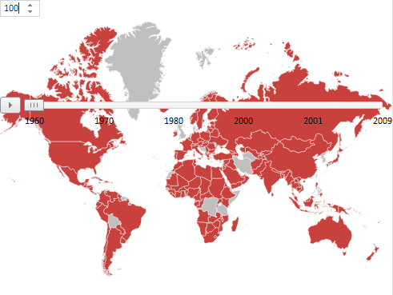

# MapTimeline.getDomNode

MapTimeline.getDomNode
-

# MapTimeline.getDomNode

## Синтаксис

getDomNode ()

## Описание

Метод getDomNode возвращает DOM-вершину, в которой расположена временная линия.

## Пример

Для выполнения примера предполагается наличие на странице компонента [MapChart](../../../Components/MapChart/MapChart.htm) с наименованием «map» (см. «[Размещение карты на HTML странице](../../../Components/MapChart/HTML_layout.htm)»), для которого настроена временная линия (см. «[Пример настройки временной линии](../../../Components/MapChart/xml_specification/MapChart/MapTimeline/TimeLine_exmpl.htm)»).

Добавим числовой редактор, при изменении значений которого будет изменяться положение временной линии относительно верхнего края страницы:

var numbers = new PP.Ui.NumberEdit({

    Width: 50,

    ParentNode: document.getElementById("div1"),

    AfterValueChange: function (sender, args) {

        var tl = map.getTimeline()

        tl.getDomNode().style.top =  numbers.getValue().toString() + "px"

    }

});

После выполнения примера на страницу будет добавлен редактор чисел. Значение редактора определяет расстояние между временной линией и верхним краем страницы:

После изменения размера карты временная линия вернется в исходное положение.

См. также:

[MapTimeline](MapTimeline.htm)

		Справочная
		 система на версию 10.9
		 от 18/08/2025,
		 © ООО «ФОРСАЙТ»,
