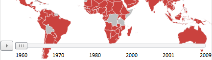
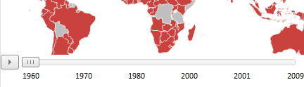

# MapTimeline.getIsOverlap

MapTimeline.getIsOverlap
-

# MapTimeline.getIsOverlap

## Синтаксис

getIsOverlap ()

## Описание

Метод getIsOverlap определяет, пересекает ли временная линия карту или нет.

## Комментарии

Если возвращается значение true, то временная линия пересекает карту, иначе - не пересекает. По умолчанию линия не пересекает карту.

Временная линия пересекает карту:

Временная линия пересекает карту:

Чтобы определить, будет ли временная линия пересекать карту, установите значение для атрибута [IsOverlap](../../../Components/MapChart/xml_specification/MapChart/MapTimeline/MapTimeline_element.htm) в [json-настройках карты](../../../Components/MapChart/xml_specification/xml-specification.htm).

## Пример

Пример использования атрибута IsOverlap приведен на странице «[Пример настройки временной линии](../../../Components/MapChart/xml_specification/MapChart/MapTimeline/TimeLine_exmpl.htm)».

См. также:

[MapTimeline](MapTimeline.htm)

		Справочная
		 система на версию 10.9
		 от 18/08/2025,
		 © ООО «ФОРСАЙТ»,
