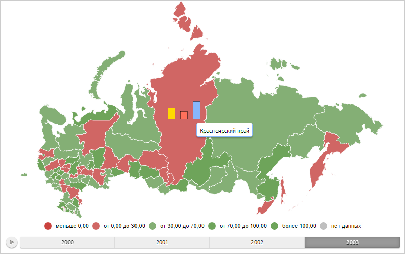

# Конструктор MapVisualItem

Конструктор MapVisualItem
-

# Конструктор MapVisualItem

## Синтаксис

PP.MapVisualItem(settings);

## Параметры

settings. JSON-объект со значениями
 свойств класса.

## Описание

Конструктор MapVisualItem создает
 экземпляр класса MapVisualItem.

## Пример

Для выполнения примера необходимо наличие на html-странице компонента
 [MapChart](../../../Components/MapChart/MapChart.htm) с наименованием
 «map» (см. «[Пример
 создания компонента MapChart](../../../Components/MapChart/MapChart_Example.htm)»). Добавим на карту новый визуальный
 элемент - столбиковый показатель для области слоя карты с идентификатором
 «RU-KYA» вместе со всплывающей подсказкой:

// Возвращает слой с областями карты
function getWorkLayer() {
    return map.getLayer("Regions");
}
// Возвращает текущий индекс календарного измерения
function getSelectedIndex() {
    return 2;
}
// Возвращает базовый класс столбикового показателя карты
function getBarVisual() {
    return map.getVisuals().barVisual0;
}
// Возвращает область слоя карты с указанным идентификатором
function getShape(shapeId) {
    var shape = getWorkLayer().getParentLayer().getShape(shapeId);
    map.setBarHoverness(shape);
    return shape;
}
// Создаёт всплывающую подсказку
function createToolTip() {
    var toolTip = new PP.Ui.ChartTooltipBase({
        HoverMode: PP.HoverMode.Click,
        MaskText: {
            IsAuto: true,
            Value: "{%Name}"
        }
    });
    toolTip.setFont(new PP.Font());
    return toolTip;
}
// Отрисовывает всплывающую подсказку
function drawToolTip(mapBar) {
    // Отображаем всплывающую подсказку
    mapBar.getToolTip().setIsVisible(mapBar.getIsVisible());
    mapBar.toggleToolTip();
}
// Создаёт столбиковый показатель
function createMapBar() {
    // Создаём столбиковый показатель
    var mapBar = new PP.MapBar({
        BarDistance: 10, // Расстояние между столбцами
        Chart: map,
        Shape: getShape("RU-KYA"), // Область слоя карты, для которой строим показатель
        MaxBarsCount: 3, // Максимальное количество столбцов
        BorderThickness: 0.5, // Толщина границы столбцов
        IsVisible: false, // Скрываем столбиковый показатель
        Visual: getBarVisual(),
        Layer: getWorkLayer(), // Слой карты
        LeastWidthPart: 10, // Ширина столбца с минимальным значением
        LeastHeightPart: 15, // Высота столбца с минимальным значением
        IsPercentage: false, // Значение столбца является процентным показателем
        ToolTip: createToolTip() // Всплывающая подсказка
    });
    mapBar.showBar = function () {
        // Отображаем всплывающую подсказку
        this.show();
        // Отображаем столбиковый показатель
        this.setIsVisible(true);
        this.drawBar();
    };
    mapBar.hideBar = function () {
        // Скрываем столбиковый показатель
        this.setIsVisible(false);
        this.drawBar();
        // Скрываем всплывающую подсказку
        this.hide();
    };
    mapBar.drawBar = function () {
        // Отрисовываем столбиковый показатель
        this.draw();
        this.getChart().draw();
    };
    return mapBar;
}
// Отрисовывает столбиковый показатель
function drawMapBar(mapBar) {
    mapBar.setSelectedIndex(getSelectedIndex());
    mapBar.getLayer().getMapBarCollection().push(mapBar);
    mapBar.drawBar();
}
// Выводит координаты текущей позиции столбикового показателя
function printBarPosition(mapBar) {
    console.log("Позиция столбикового показателя: (%s, %s)",
        mapBar.getLeft(), mapBar.getTop());
}
// Выводит размеры столбикового показателя
function printBarSize(mapBar) {
    console.log("Размеры столбикового показателя: %s x %s",
        mapBar.getWidth(), mapBar.getHeight());
}
// Перемещает столбиковый показатель
function moveBar(mapBar, x, y) {
    var rect = mapBar.getBoundsRect();
    mapBar.updatePosition(rect.getLeft() + rect.getWidth() / 2 + x,
        rect.getTop() + rect.getHeight() / 2 + y);
    mapBar.renderFrame(mapBar.getChart().getBarLayer());
}
// Создаём столбиковый показатель
var mapBar = createMapBar();
// Отрисовываем данный показатель
drawMapBar(mapBar);
// Отображаем всплывающую подсказку
drawToolTip(mapBar);
В результате выполнения примера на карту был добавлен новый визуальный
 элемент - столбиковый показатель для области слоя карты с идентификатором
 «RU-KYA» вместе со всплывающей подсказкой. Они являются скрытыми.

Теперь отобразим данный показатель, переместим его на 50 пикселей вниз
 и определим его новое расположение и размеры:

// Отображаем столбиковый показатель
mapBar.showBar();
// Перемещаем его на 50 пикселей вниз
moveBar(mapBar, 0, 50);
// Определяем расположение показателя
printBarPosition(mapBar);
// Определяем размеры показателя
printBarSize(mapBar);
После выполнения примера был отображён столбиковый показатель. Он смещён
 на 50 пикселей вниз. Столбцы показателя имеют абсолютные значения и расположены
 через 10 пикселей:

В консоли браузера были выведены координаты его новой позиции и размеры:

Позиция столбикового показателя: (328.513951, 250.248882)

Размеры столбикового показателя: 65 x 35

Чтобы скрыть столбиковый показатель и всплывающую подсказку, нужно выполнить
 следующую строку кода:

mapBar.hideBar();
После её выполнения столбиковый показатель и всплывающая подсказка были
 скрыты.

См. также:

[MapVisualItem](MapVisualItem.htm)

		Справочная
		 система на версию 10.9
		 от 18/08/2025,
		 © ООО «ФОРСАЙТ»,
