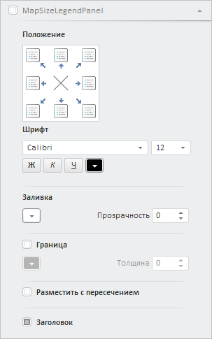

# Конструктор MapSizeLegendPanel

Конструктор MapSizeLegendPanel
-

# Конструктор MapSizeLegendPanel

## Синтаксис

MapSizeLegendPanel(settings: Object);

## Параметры

settings.  JSON-объект
 со значениями свойств класса.

## Описание

Конструктор MapSizeLegendPanel
 создает экземпляр класса [MapSizeLegendPanel](MapSizeLegendPanel.htm).

## Пример

Для выполнения примера необходимо наличие на html-странице компонента
 [ExpressBox](dhtmlExpress.chm::/Classes/Express/expressbox/expressbox.htm)
 с наименованием «expressBox» (см. «[Пример
 создания компонента ExpressBox](dhtmlExpress.chm::/components/express/expressbox/expressbox_example.htm)»). При этом должны быть открыты представление
 данных «Карта» и вкладка «Формат» на боковой панели экспресс-отчёта. Создадим
 и добавим в мастер для работы с картой панель «Легенда объёма» с заголовком
 «MapSizeLegendPanel»:

// Получим мастер для работы с картой
var mapMaster = expressBox.getPropertyBarView().getMapMaster();
// Получим массив панелей у мастера карты
var mapMasterPanels = mapMaster.getItems();
// Создадим панель «Легенда объема»
var mapSizePanel = new PP.Ui.MapSizeLegendPanel({
    ViewType: PP.Ui.NavigationItem,
    IsRTL: expressBox.getIsRTL()
});
// Отобразим элементы управления в заголовке панели
mapSizePanel.setIsHeaderControlVisible(true);
// Зададим новый заголовок панели
mapSizePanel.setTitle("MapSizeLegendPanel");
// Добавим панель в мастер для работы с картой
mapMaster.addMasterPanel(mapSizePanel);
// Обновим мастер
mapMaster.refresh(null);
// Отобразим панель
mapSizePanel.show();
// Развернём панель
mapSizePanel.expand();
В результате выполнения примера в мастере для работы с картой была добавлена,
 отображена и раскрыта панель «Легенда объёма», заголовок которой имеет
 наименование «MapSizeLegendPanel» и содержит элемент управления для её
 выбора:

См. также:

[MapSizeLegendPanel](MapSizeLegendPanel.htm)

		Справочная
		 система на версию 10.9
		 от 18/08/2025,
		 © ООО «ФОРСАЙТ»,
