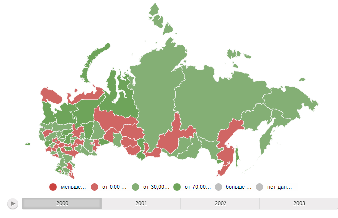

# Пример создания компонента MapChart

Пример создания компонента MapChart
-

# Пример создания компонента MapChart

Для выполнения примера необходимо создать html-страницу и выполнить
 следующие действия:

1. Добавить ссылку на css-файл PP.css.

Также нужно добавить ссылки на следующие js-файлы:

	- PP.js;

	- PP.GraphicsBase.js;

	- PP.MapChart.js;

	- PP.BaseMaster.js;

	- PP.MapMaster.js;

	- resources.ru.js.

2. В корневой папке проекта должны быть созданы следующие папки:

	- Json. В папке
	 JSON располагаются файлы, имена которых соответствуют следующему формату:
	 «MapExample_<Код территориального образования>.js». Для выполнения
	 примера обязательным является наличие файлов [MapExample_Russia.js](MapExample_Russia.js)
	 и [MapExample_World.js](MapExample_World.js);

	- png. В папке
	 png располагаются файлы со значками, имена которых соответствуют формату
	 «Yahoo_Weather_<Номер значка>.png. Для корректного выполнения
	 примера в папке должны быть размещены 7 файлов с номерами от «001»
	 до «007», например, Yahoo_Weather_003.png;

	- Topobase.
	 Данная папка содержит ещё две папки:

	-

		- SVG. Содержит
		 файлы для топоосновы типа SVG. Обязательным является наличие файла
		 Russia.svg;

		- WebGL.
		 В данной папке размещены файлы для топоосновы типа WebGL и Sphere.
		 Необходимо наличие файлов Russia.tr и World.trsp.

3. В теге <body> разместить блок с идентификатором «MapType» для
 хранения панели выбора топоосновы карты и блок «map» для хранения карты:

<body>
    <!-- Контейнер для панели выбора топоосновы карты -->
    

    <!-- Контейнер для мастера -->
    

    <!-- Контейнер для карты -->
    

</body>
3. Добавить сценарий, создающий карту:

(function() {
    // Создаём переменную, которая будет содержать карту
    map = null;
    // Указываем путь к корневой папке, содержащей файлы ресурсов
    PP.resourceManager.setRootResourcesFolder("../../../resources/");
    // Устанавливаем языковые настройки для ресурсов
    PP.setCurrentCulture(PP.Cultures.ru)
    // Определяем тип карты по умолчанию
    type = PP.MapChartType.SVG;
    // По умолчанию загружаем топооснову из файла Russia.svg в папке SVG
    var topobase = "Russia";
    var dir = "SVG";
    var ext = "svg";
    // Определяем папку с настройками карты
    var settingsDir = "Json/";
    // Определяем файл с настройками карты

    var currentUrl = "MapExample_Russia.js";
    // Функция для создания карты
    function createMap(mapData) {
        if (map) map.dispose();
        var mapContent = document.getElementById("map-content");
        // Получаем JSON-настройки карты
        var settings = JSON.parse(mapData);
        // Определяем путь к нужному файлу в зависимости от типа топоосновы
        switch (type) {
            case 'SVG':
                dir = "Topobase/SVG";
                topobase = "Russia";
                ext = "svg";
                break;
            case 'WebGL':

                dir = 'Topobase/WebGL';
                topobase = "Russia";
                ext = 'tr';
                break;
            case 'Sphere':
                dir = 'Topobase/WebGL';
                topobase = 'World';
                ext = 'trsp';
                break;
            default:
                settings.MapChart.Mode = "Drawing2D";
        };
        // Изменяем тип карты
        settings.MapChart.Type = type;

        // Запрещаем отрисовку элементов карты на канве
        settings.MapChart.RenderToCanvas = false;
        // Определяем топооснову
        settings.MapChart.Topobase = dir + "/" + topobase + "." + ext;
        settings.MapChart.ParentNode = document.getElementById("map");
        // Определяем путь к папке с картинками
        settings.MapChart.ImagePath = "../../../build/img/";
        PP.ImagePath = settings.MapChart.ImagePath;
        // Создаём карту
        map = new PP.MapChart(settings.MapChart ? settings.MapChart : settings);
        // Перерисовываем размеры карты
        updateSize();
    };
    // Выполняет Ajax-запрос для получения файла с JSON-настроками карты

    function getRequest(dataURL) {
        var Request = new PP.Ajax({
            Url: dataURL,
            Success: function(sender, args) {
                createMap(args.ResponseText); // Создаём карту
                Request.dispose();
            }
        });
        Request.send(); // Отправляем запрос
    }
    var idTime;
    // Обновляет размеры карты и удаляет ненужные слои
    function updateSize() {
        if (idTime) clearTimeout(idTime);
        idTime = setTimeout(function() {
            if (map) {

                if (map.getMapTerritoryTranscript()) {
                    map.getMapTerritoryTranscript().hide();
                };
                map.getMilestoneLayer().remove();
                map.getArrowLayer().remove();
            }
        }, 100);
    }
    // Загружает карту
    function loadMapChart() {
        getRequest(settingsDir + currentUrl);
        createToolBar(); // Создаём панель кнопок для переключения типа карты
    }
    // Создаёт панель с кнопками для переключения типа топоосновы карты
    function createToolBar() {
        MapType = new PP.Ui.ToolBar({

            ParentNode: "MapType",
            Items: [{
                Content: 'SVG',
                Id: 'SVG',
                IsChecked: true,
                GroupName: 'mode'
            }, {
                Content: 'WebGL',
                Id: 'WebGL',
                GroupName: 'mode',
                IsVisible: !PP.IsIE
            }, {
                Content: 'Sphere',
                Id: 'Sphere',
                GroupName: 'mode',

                IsVisible: !PP.IsIE
            }],
            IsVisible: false // Скрываем панель инструментов
        });
        MapType.Click.add(changeType);
    }
    /* Обрабатывает нажатия кнопок, расположенных на панели выбора
    типа топоосновы карты */
    function changeType(s, a) {
        if (a.Item) {
            var aa = a.Item;
            if (aa instanceof PP.Ui.ToolBarButton) {
                changeMapType(a.Item.getContent());
            }
        }
    }

    // Изменяет тип карты
    changeMapType = function(type) {
        this.type = type;
        switch (type) {
            case 'SVG':
            case 'WebGL':
                currentUrl = "MapExample_Russia.js";
                getRequest(settingsDir + currentUrl);
                break;
            case 'Sphere':
                currentUrl = "MapExample_World.js";
                getRequest(settingsDir + currentUrl);
                break;
            default:
                map.setType(type);
        }
    }

    // Создаёт панель масштабирования миникарты
    function createMiniMap() {
            var miniMap = new PP.Ui.MiniMap({
                // Устанавливаем ширину панели масштабирования
                Width: 100,
                // Устанавливаем признак отображения карты
                ShowMap: true,
                // Устанавливаем признак отображения кнопок управления масштабом
                ShowButtons: true,
                // Устанавливаем признак изменения пропорций карты при изменении размера
                KeepProportions: false,
                // Устанавливаем признак сохранения начальных границ
                KeepInitialBounds: true,
                // Устанавливаем высоту кнопок управления масштабом
                ButtonsHeight: 20,

                FrameStyle: new PP.Style({
                    Background: new PP.SolidColorBrush({
                        Color: PP.Color.Colors.lightgreen
                    })
                })
            });
            // Добавляем панель масштабирования на карту
            map.setMiniMap(miniMap);
            // Устанавливаем управляющий элемент панели масштабирования
            miniMap._Control = map;
            // Отображаем панель масштабирования на карте
            map.setMiniMapEnabled(true, false);
            // Убираем значки погоды
            map._MilestoneLayer.remove();
        }
        // Загружаем карту
    loadMapChart();
})();
Примечание.
 Пользователь может указать свои пути к файлам сценариев, ресурсов и изображений.

4. Для отображения сферы необходимо в конфигурационном файле веб-приложения
 web.config внутри элемента <staticContent> добавить следующий элемент:

<mimemap fileextension=".trsp" mimetype="application/x-trsp">
Для выполнения пользовательских сценариев над картой, в том числе примеров,
 приведённых на страницах описания свойств, методов и событий данного компонента
 и составляющих его элементов, требуется разместить код либо после
 указанного выше сценария, либо в консоли браузера.

В результате выполнения примера на html-странице будет размещен компонент
 [PP.MapChart](MapChart.htm):

См. также:

[MapChart](MapChart.htm)

		Справочная
		 система на версию 10.9
		 от 18/08/2025,
		 © ООО «ФОРСАЙТ»,
