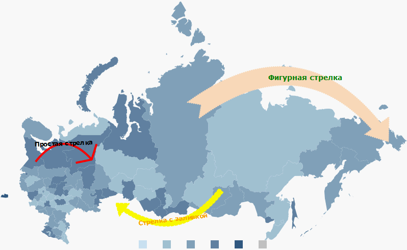

# Пример настройки стрелок

Пример настройки стрелок
-

# Пример настройки стрелок

Для выполнения примера понадобится [xml-файл](../../xml-specification.htm) с данными для карты в формате [JSON](../../../xml_and_json.htm), [HTML страница](../../../HTML_layout.htm), на которой расположена карта, и топооснова Russia.svg.

Примечание. При автоматической конвертации из формата XML в JSON перед атрибутами появляется знак «@», который можно не удалять.

Добавим на карту три разные стрелки.

В [словарь элементов](../ItemsDictionary/ItemsDictionary.htm) необходимо добавить описание следующих [шрифтов](../ItemsDictionary/Fonts/Fonts.htm):

//Для фигурной стрелки

        {

         "@IsItalic" : "False",

         "@FontFamily" : "Verdana",

         "@Size" : "14",

         "@Id" : "FiguredArrowFont",

         "@IsBold" : "True",

         "@Color" : "Green"

        },

//Для стрелки с заливкой:

        {

         "@IsItalic" : "False",

         "@FontFamily" : "Verdana",

         "@Size" : "12",

         "@Id" : "FilledArrowFont",

         "@IsBold" : "True",

         "@Color" : "Orange"

        },

//Для простой стрелки:

        {

         "@IsItalic" : "False",

         "@FontFamily" : "Verdana",

         "@Size" : "12",

         "@Id" : "SimpleArrowFont",

         "@IsBold" : "True",

         "@Color" : "Black"

        }

Добавим в [элемент <MapChart>](../MapChart_element.htm) список стрелок:

 "MapArrows" :

    {

//[Простая стрелка](MapSimpleArrow_element.htm)

     "MapSimpleArrow" :

     {

       "@PointerWidth" : "0.5",

       "@TextOrientation" : "AlongTheArrow",

       "@PointerLength" : "0.5",

       "@StrokeThickness" : "4",

       "@Text" : "Простая стрелка",

       "@TextBackground" : "Transparent",

       "@Angle" : "50",

       "@Font" : "{SimpleArrowFont}",

       "@EndShape" : "{RU-KO}",

       "@StrokeStyle" : "Solid",

       "@Color" : "Red",

       "@StartShape" : "{RU-KR}"

      },

//[Стрелка с заливкой](MapFilledArrow_element.htm)

     "MapFilledArrow" :

      {

       "@PointerWidth" : "0.15",

       "@TextOrientation" : "AlongTheArrow",

       "@PointerLength" : "0.1",

       "@StrokeThickness" : "2",

       "@Text" : "Стрелка с заливкой",

       "@TextBackground" : "Transparent",

       "@Angle" : "45",

       "@Font" : "{FilledArrowFont}",

       "@EndShape" : "{RU-KGN}",

       "@StrokeStyle" : "Dash",

       "@Color" : "Yellow",

       "@StartShape" : "{RU-IRK}",

       "@BasementWidth" : "0.05"

      },

//[Фигурная стрелка](MapFiguredArrow_element.htm)

     "MapFiguredArrow" :

      {

       "@PointerWidth" : "0.15",

       "@TextOrientation" : "Horizontal",

       "@PointerLength" : "0.1",

       "@StrokeThickness" : "2",

       "@Text" : "Фигурная стрелка",

       "@TextBackground" : "Transparent",

       "@Angle" : "45",

       "@Font" : "{FiguredArrowFont}",

       "@EndShape" : "{RU-CHU}",

       "@StrokeStyle" : "Dot",

       "@Color" : "PeachPuff",

       "@StartShape" : "{RU-KYA}",

       "@BasementWidth" : "0.1"

      }

    }

После выполнения примера на карте появятся три стрелки:

См. также:

[Элемент MapArrows](MapArrows_element.htm)

		Справочная
		 система на версию 10.9
		 от 18/08/2025,
		 © ООО «ФОРСАЙТ»,
