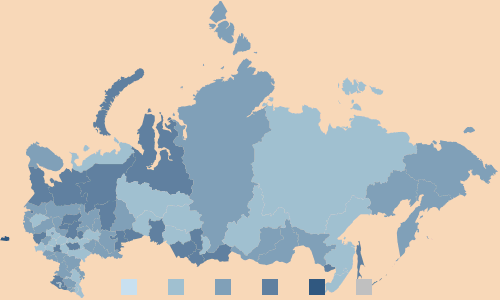

# Пример настройки элемента &lt;MapChart&gt;

Пример настройки элемента <MapChart>
-

# Пример настройки элемента MapChart

Для выполнения примера понадобится [xml-файл](../xml-specification.htm) с настройками для карты с данными, преобразованными в формат [JSON](../../xml_and_json.htm), и [HTML страница](../../HTML_layout.htm), на которой расположена карта. Изменим настройки карты:

{

  "MapChart" :

  {

     "Height" : "300",

     "Width" : "500",

     "Background" : "PeachPuff",

     "TopobaseHorizontalAlignment": "Center",

     "TopobaseVerticalAlignment": "Center"

     //далее настройка элементов

   }

}

После выполнения примера будут изменены размеры компонента [MapChart](../../MapChart.htm), изменится цвет фона:

См. также:

[Элемент MapChart](MapChart_element.htm)

		Справочная
		 система на версию 10.9
		 от 18/08/2025,
		 © ООО «ФОРСАЙТ»,
