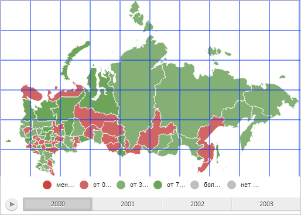

# Пример настройки сетки карты

Пример настройки сетки карты
-

# Пример настройки сетки карты

Для выполнения примера, создающего сетку на карте, воспользуется [примером создания компонента MapChart](../MapChart_element.htm). Далее необходимо в содержимое файла MapXMLExample_RU.js после описания элемента [MapTerritoryTranscript](../MapTerritoryTranscript/MapTerritoryTranscript_element.htm) вставить следующий код:

"MapGrid": {
    "@Color": "#0033FF",
    "@Thickness": 1,
    "@VerticalLinesStep": 50,
    "@HorizontalLinesStep": 50,
    "@HorizontalLinesStepType": "Pixels",
    "@VerticalLinesStepType": "Pixels"
},

В результате выполнения примера на карту будет добавлена сетка, линии которой имеют синий цвет и толщину, равную одному пикселю. Расстояние между горизонтальными и вертикальными линиями сетки будет равно 50 пикселям:

См. также:

[Элемент MapGrid](MapGrid_Element.htm)

		Справочная
		 система на версию 10.9
		 от 18/08/2025,
		 © ООО «ФОРСАЙТ»,
