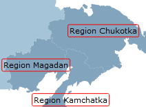

# Пример настройки слоя карты

Пример настройки слоя карты
-

# Пример настройки слоя карты

Для выполнения примера необходимо наличие [xml-файла](../../xml-specification.htm) с наименованием «MapXmlExample_RU.xml», топоосновы Russia.svg и [html-страницы](../../../HTML_layout.htm), на которой расположена карта. Настройки карты должны быть представлены в формате [JSON](../../../xml_and_json.htm).

Примечание. При автоматической конвертации из формата XML в JSON перед атрибутами появляется знак «@», который можно не удалять.

Xml-файл должен содержать следующие элементы:

-
описание [всплывающей подсказки](../ItemsDictionary/MapToolTops/ToolTip_exmpl.htm) с идентификатором «Tooltip» в [словаре элементов](../ItemsDictionary/ItemsDictionary.htm);

-
описание [эффекта](../ItemsDictionary/Effects/Effaects_exmpl.htm) с идентификатором «BorderEffect» в [словаре элементов](../ItemsDictionary/ItemsDictionary.htm);

-
описание [шрифта](../ItemsDictionary/Fonts/Font_exmpl.htm) с идентификатором «BlackFont» в [словаре элементов](../ItemsDictionary/ItemsDictionary.htm);

-
описание [источника данных](../DataSources/DataSources_exmpl.htm) с идентификатором «world»;

-
описание [шкалы](../ItemsDictionary/MapScale/MapScale_exmpl.htm) с идентификатором «AreaVisualScale»  [словаре элементов](../ItemsDictionary/ItemsDictionary.htm).

Добавим элемент <[MapLayers>](MapLayers_element.htm)> в корневой элемент <[MapChart](../MapChart_element.htm)>:

"MapLayers": {

   "MapLayer": {

//Настройка всплывающей подсказки

      "@ToolTip": "{Tooltip}",

      "@Id": "Regions",

//Настройка эффекта

      "@Effect": "{BorderEffect}",

//Настройка метки

      "MapLayer.Label": {

         "MapLabel": {

            "@Background": "Transparent",

            "@Width": "100",

            "@MaskText": "Region {0}",

            "@Top": "10",

            "@Text": "DefaultRegion",

            "@BorderRadius": "2",

            "@Padding": "2 2 2 2",

            "@Font": "{BlackFont}",

            "@Visibility": "Visible",

            "@Height": "400",

            "@BorderThickness": "1",

            "@Left": "5",

            "@BorderColor": "Red",

            "@TextWrapping": "NoWrap",

            "@Margin": "2 2 2 2"

         }

      },

//Настройка показателя заливки

      "MapLayer.Visuals": {

         "MapAreaVisual": {

            "@Name": "Сбор урожая",

            "@Visibility": "Visible",

            "@Index": "0",

            "@DataSource": "{world}",

            "@Id": "AreaVisual",

            "MapAreaVisual.Background": {

               "DataDependency": {

                  "@IsDependent": "True",

                  "@MapScale": "{AreaVisualScale}",

                  "@TypeArguments": "Brush",

                  "@DataSource": "{world}"

               }

            }

         }

      }

   }

}

После выполнения примера для карты будет настроен слой с идентификатором «Regions». Для слоя установлены всплывающая подсказка, метка, эффект и настроен показатель заливки. Далее приведен фрагмент карты с указанными выше настройками:

См. также:

[MapChart](../../../../../Classes/Map/MapChart/MapChart.htm)

		Справочная
		 система на версию 10.9
		 от 18/08/2025,
		 © ООО «ФОРСАЙТ»,
