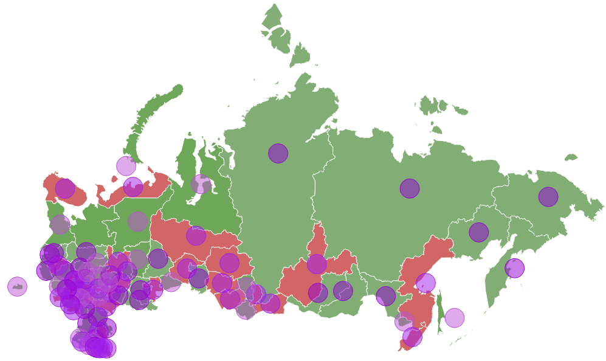

# Пример настройки пузырькового показателя

Пример настройки пузырькового показателя
-

# Пример настройки пузырькового показателя

Для выполнения примера необходимо наличие [xml-файла](../../../../xml-specification.htm) с наименованием «MapXmlExample_RU.xml», топоосновы Russia.svg и [html-страницы](../../../../../HTML_layout.htm), на которой расположена карта. Настройки карты должны быть представлены в формате [JSON](../../../../../xml_and_json.htm).

Примечание. При автоматической конвертации из формата XML в JSON перед атрибутами появляется знак «@», который можно не удалять.

Xml-файл должен содержать следующие элементы:

-
источник данных с идентификатором «DataSource0»;

-
объекты зависимостей для размера и цвета пузырьков с идентификаторами «BubbleColorDataDependency» и «BubbleSizeDataDependency» соответственно.

Для настройки показателя заливки карты в элемент "[Visuals](Visuals_element.htm)" добавим элемент "[MapBubbleVisual](MapBubbleVisual_element.htm)".

Примечание. В случае описания свойств объектов в виде элементов, а не атрибутов, используется синтаксис ИмяОбъекта.ИмяСвойства (например, MapLayer.Visuals).

"MapBubbleVisual":
{
"@Background": "{BubbleColorDataDependency}",
"@Size": "{BubbleSizeDataDependency}",
"@Name": "Рождаемость",
"@Visibility": "Visible",
"@Id": "BubbleVisual",
"@LeastSizePart": "2",
"@DataSource": "{DataSource0}"
}

После выполнения примера на карте будет отображаться пузырьковый показатель:

См. также:

[Элемент MapBubbleVisual](MapBubbleVisual_element.htm)

		Справочная
		 система на версию 10.9
		 от 18/08/2025,
		 © ООО «ФОРСАЙТ»,
