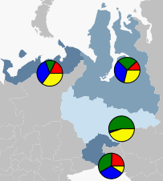

# Пример настройки кругового показателя

Пример настройки кругового показателя
-

# Пример настройки кругового показателя

Для выполнения примера необходимо наличие [xml-файла](../../../../xml-specification.htm) с наименованием «MapXmlExample_RU.xml», топоосновы Russia.svg и [html-страницы](../../../../../HTML_layout.htm), на которой расположена карта. Настройки карты должны быть представлены в формате [JSON](../../../../../xml_and_json.htm).

Примечание. При автоматической конвертации из формата XML в JSON перед атрибутами появляется знак «@», который можно не удалять.

Xml-файл должен содержать следующие элементы:

-
[шкалы](../../../ItemsDictionary/MapScale/MapScale_exmpl.htm) с идентификаторами «BarVisualScale_color» и «BarVisualScale» (в [словаре элементов](../../../ItemsDictionary/ItemsDictionary.htm));

-
[источники данных](../../../DataSources/DataSources_exmpl.htm) с идентификаторами «source» и «BarBackSource» (в [списке источников данных](../../../DataSources/DataSources_element.htm) ), в которых хранятся данные для 4 регионов: Ямало-Ненецкий автономный округ, Ханты-Мансийский автономный округ, Тюменская область, Ненецкий автономный округ;

-
[Объекты зависимости](../../../ItemsDictionary/DataDependency/DataDependency_exmpl.htm) с идентификаторами «BarBackDataDependency», «StaticRadiusDataDependency» и «StaticColorDataDependency» (в [словаре элементов](../../../ItemsDictionary/ItemsDictionary.htm)).

Для настройки столбикового показателя в элемент "[Visuals](Visuals_element.htm)" добавим элемент"[MapAreaVisual](MapAreaVisual_element.htm)".

Примечание. В случае описания свойств объектов в виде элементов, а не атрибутов, используется синтаксис ИмяОбъекта.ИмяСвойства (например, MapLayer.Visuals).

"MapLayer.Visuals":

{

   "MapPieVisual":

     {

       "Background": "{BarBackDataDependency}",

       "LeastRadiusPart": "2",

       "Radius": "{StaticRadiusDataDependency}",

       "Name": "Рождаемость",

       "MaxPiesCount": "4",

       "Visibility": "Collapsed",

       "BorderThickness": "1",

       "IsProportional": "False",

       "Id": "PieVisual",

       "BorderColor": "{StaticColorDataDependency}",

       "DataSource": "{source}"

     }

}

После выполнения примера на карте для 4 регионов будет отображен круговой показатель:

В данном примере регионы выделены цветом, поскольку были применены [настройки для показателя заливки](Visuals_exmpl.htm).

См. также:

[Элемент MapPieVisual](MapPieVisual_element.htm)

		Справочная
		 система на версию 10.9
		 от 18/08/2025,
		 © ООО «ФОРСАЙТ»,
