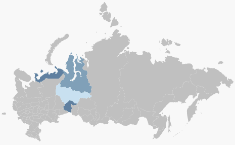

# Пример настройки показателя заливки карты

Пример настройки показателя заливки карты
-

# Пример настройки показателя заливки карты

Для выполнения примера необходимо наличие [xml-файла](../../../../xml-specification.htm) с наименованием «MapXmlExample_RU.xml», топоосновы Russia.svg и [html-страницы](../../../../../HTML_layout.htm), на которой расположена карта. Настройки карты должны быть представлены в формате [JSON](../../../../../xml_and_json.htm).

Примечание. При автоматической конвертации из формата XML в JSON перед атрибутами появляется знак «@», который можно не удалять.

Xml-файл должен содержать следующие элементы:

-
[шкалу](../../../ItemsDictionary/MapScale/MapScale_exmpl.htm) с идентификатором «AreaVisualScale» (в [словаре элементов](../../../ItemsDictionary/ItemsDictionary.htm));

-
источник данных с идентификатором «source» (в [списке источников данных](../../../DataSources/DataSources_element.htm) ), в котором хранятся данные для 4 регионов: Ямало-Ненецкий автономный округ, Ханты-Мансийский автономный округ, Тюменская область, Ненецкий автономный округ.

Для настройки показателя заливки карты в элемент "[Visuals](Visuals_element.htm)" добавим элемент"[MapAreaVisual](MapAreaVisual_element.htm)".

Примечание. В случае описания свойств объектов в виде элементов, а не атрибутов, используется синтаксис ИмяОбъекта.ИмяСвойства (например, MapLayer.Visuals).

"MapLayer.Visuals":

{

   "MapAreaVisual" :

     {

        "Name" : "Сбор урожая",

        "Visibility" : "Visible",

        "Index" : "0",

        "Id" : "AreaVisual",

        "MapAreaVisual.Background" :

            {

              "DataDependency" :

                {

                   "IsDependent" : "True",

                   "MapScale" : "{AreaVisualScale}",

                   "TypeArguments" : "Brush",

                   "DataSource" : "{source}"

                }

             }

       }

}

После выполнения примера для 4 регионов будет настроен показатель заливки:

См. также:

[Элемент Visuals](Visuals_element.htm)

		Справочная
		 система на версию 10.9
		 от 18/08/2025,
		 © ООО «ФОРСАЙТ»,
