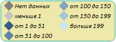

# Пример настройки легенды

Пример настройки легенды
-

# Пример настройки легенды

На странице приведен код настройки легенды в формате [JSON](../../../xml_and_json.htm). Данный код должен быть размещен в [xml-файл](../../xml-specification.htm)е с настройками карты внутри корневого элемента [MapChart](../MapChart_element.htm). Предполагается наличие в словаре элементов:

-
описания [шрифта](../ItemsDictionary/Fonts/Font_exmpl.htm) с идентификатором «BlackFont»;

-
описания [шкалы](../ItemsDictionary/MapScale/MapScale_exmpl.htm) с идентификатором «AreaVisualScale».

"MapLegends":

{

        "MapLegend":

      {

           "Width": "0",

           "Background": "#EEE8AA",

           "LessFormat": "меньше{0}",

           "EqualFormat": "равно{0}",

           "Marker": "Rhombus",

           "BorderRadius": "8",

           "MapScale": "{AreaVisualScale}",

           "BorderThickness": "1",

           "Left": "800",

           "Id": "FirstLegend",

           "GreaterFormat": "больше{0}",

           "BetweenFormat": "от {0} до{1}",

           "Top": "10",

           "Font": "{BlackFont}",

           "Padding": "2222",

           "Height": "0",

           "BorderColor": "#20B2AA",

           "ColumnCount": "2",

           "Margin": "5050",

           "IsOuter": "True",

           "NoDataText": "Нет данных",

           "NoDataPosition": "Before"

        }

}

После выполнения примера на странице будет размещена легенда карты, имеющая следующий вид:

См. также:

[Элемент MapLegends](MapLegends_element.htm)

		Справочная
		 система на версию 10.9
		 от 18/08/2025,
		 © ООО «ФОРСАЙТ»,
