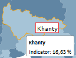

# Пример настройки области карты

Пример настройки области карты
-

# Пример настройки областей карты

На странице приведен код настройки легенды в формате [JSON](../../../xml_and_json.htm). Данный код должен быть размещен в [xml-файл](../../xml-specification.htm)е с настройками карты внутри корневого элемента [<MapChart>](../MapChart_element.htm). Необходимо наличие топоосновы Russia.svg. [Словарь элементов](../ItemsDictionary/ItemsDictionary.htm) должен содержать:

-
описание [шрифта](../ItemsDictionary/Fonts/Font_exmpl.htm) с идентификатором «BlackFont»;

-
описание [подсказки](../ItemsDictionary/MapToolTops/ToolTip_exmpl.htm) с идентификатором «Tooltip»;

-
описание [эффекта](../ItemsDictionary/Effects/Effaects_exmpl.htm) с идентификатором «BorderEffect».

"MapShapes": {

   "MapShape": {

      "Id": "RU-KHM",

      "ToolTip": "{Tooltip}",

      "MapShape.Label": {

         "MapLabel": {

            "@Background": "White",

            "@Width": "100",

            "@MaskText": "Это {0}",

            "Text": "Khanty",

            "@Top": "10",

            "@BorderRadius": "0",

            "@Padding": "2 2 2 2",

            "@Font": "{BlackFont}",

            "@Visibility": "Visible",

            "@Height": "400",

            "@BorderThickness": "1",

            "@Left": "5",

            "@BorderColor": "Red",

            "@TextWrapping": "NoWrap",

            "@Margin": "2 2 2 2"

         }

      },

      "Effect": "{BorderEffect}"

   }

}

После выполнения примера для области карты с идентификатором «RU-KHM» будет отображаться метка с текстом «Khanty». При наведении курсора на область границы загораются оранжевым цветом и появляется всплывающая подсказка:

См. также:

[Элемент MapShapes](MapShapes_element.htm)

		Справочная
		 система на версию 10.9
		 от 18/08/2025,
		 © ООО «ФОРСАЙТ»,
