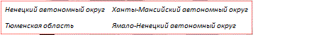

# Пример настройки расшифровки территорий

Пример настройки расшифровки территорий
-

# Пример настройки расшифровки территорий

На странице приведен код настройки расшифровки территорий в формате [JSON](../../../xml_and_json.htm). Данный код должен быть размещен в [xml-файл](../../xml-specification.htm)е с настройками карты внутри корневого элемента [MapChart](../MapChart_element.htm). Необходимо наличие [слоя](../MapLayers/Layers_exmpl.htm) карты с идентификатором «Regions». В [словаре элементов](../ItemsDictionary/ItemsDictionary.htm) должны находиться описания [шрифта](../ItemsDictionary/Fonts/Font_exmpl.htm) с идентификатором «BlackFont» и [кисти](../ItemsDictionary/Brushes/Brushes_exmpl.htm) с идентификатором «GrayBrush».

"MapTerritoryTranscript":

{

          "Width": "0",

          "Background": "#ffffffff",

          "BorderRadius": "0",

          "ParentLayer": "{Regions}",

          "BorderThickness": "1",

          "Left": "60",

          "SortingMode": "Asc",

          "TextWrapping": "NoWrap",

          "Top": "470",

          "Padding": "5 5 5 5",

          "Font": "{BlackFont}",

          "ColumnCount": "2",

          "Height": "0",

          "HighlightBrush": "{GrayBrush}",

          "BorderColor": "Red",

          "Margin": "0 0 0 0"

}

После выполнения примера будет размещена расшифровка территорий, содержащая наименования регионов, которые содержатся в [словаре имен областей](../RegionsNames/RegionsNames_exmpl.htm) карты:

Названия региона выделяются серым цветом при наведении на них курсора.

См. также:

[Элемент MapTerritoryTranscript](MapTerritoryTranscript_element.htm)

		Справочная
		 система на версию 10.9
		 от 18/08/2025,
		 © ООО «ФОРСАЙТ»,
