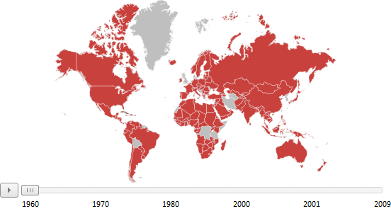

# Пример настройки временной линии

Пример настройки временной линии
-

# Пример настройки временной линии

На странице приведен пример настройки временной линии в формате [JSON](../../../xml_and_json.htm).

"MapTimeline": {

    "@Visibility": "Visible",

    "@HorizontalAlignment": "Center",

    "@VerticalAlignment": "Bottom",

    "@DataSource": "{DataSource0 DataSource1}",

    "@StepTime": "1000",

    "@DelayTime": "1000",

    "IsOverlap": "false",

    "@ReturnToInitialState": "True",

    "SetupOnStep": "True",

    "MapTimeline.StepsNames": {

        "StepName": [

        {

            "@Name": "1960"

        },

        {

            "@Name": "1970"

        },

        {

            "@Name": "1980"

        },

        {

            "@Name": "2000"

        },

        {

            "@Name": "2001"

        },

        {

            "@Name": "2009"

        }]

    }

}

После выполнения примера к карте будет добавлена временная линия, имеющая следующий вид:

См. также:

[Элемент MapTimeline](MapTimeline_element.htm)

		Справочная
		 система на версию 10.9
		 от 18/08/2025,
		 © ООО «ФОРСАЙТ»,
