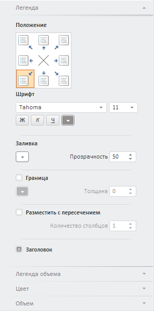

# MapMaster

MapMaster
-

**

# MapMaster

## Описание

Компонент MapMaster представляет
 собой мастер для настройки [карты](../MapChart/MapChart.htm).

## Комментарии

Компонент реализован классом [MapMaster](../../Classes/MapMaster/MapMaster.htm).

[NavigationBar](dhtmlCommon.chm::/Classes/NavigationBar/NavigationBar.htm)
 - базовый компонент для MapMaster.
 Изменять настройки [NavigationBar](dhtmlCommon.chm::/Classes/NavigationBar/NavigationBar.htm)
 можно, вернув его при помощи метода [ProxyControl.getControl](dhtmlUi.chm::/Classes/ProxyControl/ProxyControl.getControl.htm).

## Пример

Компонент MapMaster имеет следующий
 вид:

[Пример размещения компонентов
 MapMaster и EaxMapBox](MapMaster_and_EaxMasterBox.htm)

[Пример размещения компонентов MapMaster
 и MapChart](MapMaster_and_MapChart.htm)

## Конструктор

		 Имя конструктора
		 Краткое описание

		 
		 [MapMaster](dhtmlMapChart.chm::/Classes/MapMaster/Constructor_MapMaster.htm)
		 Конструктор MapMaster
		 создает экземпляр компонента MapMaster.

## Свойства

		 Имя свойства
		 Краткое описание

		 
		 [AreMetricsOn](dhtmlMapChart.chm::/Classes/MapMaster/MapMaster.AreMetricsOn.htm)
		 Свойство AreMetricsOn
		 определяет признак использования метрик в мастере.

		 
		 [DataView](dhtmlMapChart.chm::/Classes/MapMaster/MapMaster.DataView.htm)
		 Свойство DataView**
		 определяет карту экспресс-отчета или компонент [MapChart](dhtmlMapChart.chm::/Components/MapChart/MapChart.htm),
		 на который будут действовать настройки мастера.

		 
		 [MapChartSL](dhtmlMapChart.chm::/Classes/MapMaster/MapMaster.MapChartSL.htm)
		 Свойство **MapChartSL**
		 определяет карту в режиме 3D, на которую действуют настройки мастера.

## Методы

		 Имя метода
		 Краткое описание

		 
		 [getAreaVisualPanel](dhtmlMapChart.chm::/Classes/MapMaster/MapMaster.getAreaVisualPanel.htm)
		 Метод **getAreaVisualPanel**
		 возвращает [панель
		 «Цветовой индикатор»](dhtmlMapChart.chm::/Classes/MapMaster/MapMaster.getAreaVisualPanel.htm) [мастера
		 карты](dhtmlMapChart.chm::/Components/MapMaster/MapMaster.htm).

		 
		 [getLegendPanel](dhtmlMapChart.chm::/Classes/MapMaster/MapMaster.getLegendPanel.htm)
		 Метод **getLegendPanel**
		 возвращает [панель
		 «Легенда»](dhtmlMapChart.chm::/Classes/MapMaster/MapMaster.getLegendPanel.htm) [мастера
		 карты](dhtmlMapChart.chm::/Components/MapMaster/MapMaster.htm).

		 
		 [getVisual3DPanel](dhtmlMapChart.chm::/Classes/MapMaster/MapMaster.getVisual3DPanel.htm)
		 Метод **getVisual3DPanel**
		 возвращает [панель
		 «Индикатор объема»](dhtmlMapChart.chm::/Classes/Visual3DPanel/MapMaster.Visual3DPanel.htm) [мастера
		 карты](dhtmlMapChart.chm::/Components/MapMaster/MapMaster.htm).

		 
		 [hide3DPanel](dhtmlMapChart.chm::/Classes/MapMaster/MapMaster.hide3DPanel.htm)
		 Метод **hide3DPanel**
		 скрывает [панель
		 «Индикатор объема»](dhtmlMapChart.chm::/Classes/Visual3DPanel/MapMaster.Visual3DPanel.htm) [мастера
		 карты](dhtmlMapChart.chm::/Components/MapMaster/MapMaster.htm).

		 
		 [show3DPanel](dhtmlMapChart.chm::/Classes/MapMaster/MapMaster.show3DPanel.htm)
		 Метод **show3DPanel**
		 отображает [панель
		 «Индикатор объема»](dhtmlMapChart.chm::/Classes/Visual3DPanel/MapMaster.Visual3DPanel.htm) [мастера
		 карты](dhtmlMapChart.chm::/Components/MapMaster/MapMaster.htm).

## События

		 Имя события
		 Краткое описание

		 
		 [Loaded](dhtmlMapChart.chm::/Classes/MapMaster/MapMaster.Loaded.htm)
		 Событие **Loaded**
		 наступает при загрузке мастера.

## Методы, унаследованные от класса [Master](dhtmlUi.chm::/Classes/master/master.htm)

		 Имя метода
		 Краткое описание

		 
		 [addClassToTitles](dhtmlUi.chm::/Classes/Master/Master.addClassToTitles.htm)
		 Метод addClassToTitles
		 устанавливает дополнительный класс стиля заголовку всех вкладок
		 мастера, за исключением первой.

		 
		 [addMaster](dhtmlUi.chm::/Classes/Master/Master.addMaster.htm)
		 Метод addMaster добавляет
		 дочерний мастер.

		 
		 [addMasterPanel](dhtmlUi.chm::/Classes/Master/Master.addMasterPanel.htm)
		 Метод addMasterPanel
		 добавляет панель мастера.

		 
		 [addNavItem](dhtmlUi.chm::/Classes/Master/Master.addNavItem.htm)
		 Метод addNavItem добавляет
		 элемент управления в мастер.

		 
		 [beginUpdate](dhtmlUi.chm::/Classes/Master/Master.beginUpdate.htm)
		 Метод beginUpdate начинает
		 обновление мастера.

		 
		 [clearItems](dhtmlUi.chm::/Classes/Master/Master.clearItems.htm)
		 Метод clearItems очищает
		 список панелей.

		 
		 [endUpdate](dhtmlUi.chm::/Classes/Master/Master.endUpdate.htm)
		 Метод endUpdate завершает
		 обновление мастера.

		 
		 [expandFirstItem](dhtmlUi.chm::/Classes/Master/Master.expandFirstItem.htm)
		 Метод expandFirstItem
		 разворачивает первую видимую вкладку, если мастер видимый.

		 
		 [getActiveGroupName](dhtmlUi.chm::/Classes/Master/Master.getActiveGroupName.htm)
		 Метод getActiveGroupName
		 возвращает имя показанной в данный момент группы контекстно-зависимых
		 панелей.

		 
		 [getActivePanel](dhtmlUi.chm::/Classes/Master/Master.getActivePanel.htm)
		 Метод getActivePanel
		 возвращает активную панель мастера.

		 
		 [getItem](dhtmlUi.chm::/Classes/Master/Master.getItem.htm)
		 Метод getItem возвращает
		 панель мастера по ее типу или порядковому номеру в списке панелей.

		 
		 [getItems](dhtmlUi.chm::/Classes/Master/Master.getItems.htm)
		 Метод getItems возвращает
		 массив панелей мастера.

		 
		 [hideGroup](dhtmlUi.chm::/Classes/Master/Master.hideGroup.htm)
		 Метод hideGroup скрывает
		 группы вкладок по имени.

		 
		 [refresh](dhtmlUi.chm::/Classes/Master/Master.refresh.htm)
		 Метод refresh обновляет
		 все панели мастера.

		 
		 [refreshGroup](dhtmlUi.chm::/Classes/Master/Master.refreshGroup.htm)
		 Метод refreshGroup
		 обновляет панели, относящиеся к определённой группе.

		 
		 [removeMaster](dhtmlUi.chm::/Classes/Master/Master.removeMaster.htm)
		 Метод removeMaster
		 удаляет дочерний мастер.

		 
		 [removeMasterPanel](dhtmlUi.chm::/Classes/Master/Master.removeMasterPanel.htm)
		 Метод removeMasterPanel
		 удаляет панель мастера.

		 
		 [removePanelsByGroup](dhtmlUi.chm::/Classes/Master/Master.removePanelsByGroup.htm)
		 Метод removePanelsByGroup
		 удаляет панели по имени группы, к которой они относятся.

		 
		 [showGroup](dhtmlUi.chm::/Classes/Master/Master.showGroup.htm)
		 Метод showGroup отображает
		 группы вкладок по имени.

		 
		 [showOnlyGroup](dhtmlUi.chm::/Classes/Master/Master.showOnlyGroup.htm)
		 Метод showOnlyGroup
		 отображает только указанные группы, остальные скрывает.

## События, унаследованные от класса [Master](dhtmlUi.chm::/Classes/master/master.htm)

		 Имя события
		 Краткое описание

		 
		 [ControlChanged](dhtmlUi.chm::/Classes/Master/Master.ControlChanged.htm)
		 Событие ControlChanged
		 наступает при смене состояния элементов управления, входящих в
		 состав мастера.

## Методы, унаследованные от класса [ProxyControl](dhtmlUi.chm::/Classes/proxycontrol/proxycontrol.htm)

		 Имя метода
		 Краткое описание

		 
		 [getControl](dhtmlUi.chm::/classes/proxycontrol/proxycontrol.getcontrol.htm)
		 Метод getControl возвращает
		 базовый элемент управления - наследник PP.Ui.Control.

## Свойства, унаследованные от класса [Control](dhtmlUi.chm::/Classes/control/control.htm)

		 Имя свойства
		 Краткое описание

		 
		 [Anchors](dhtmlUi.chm::/Classes/Control/Control.Anchors.htm)
		 Свойство Anchors определяет
		 позицию компонента, размещенного внутри контейнера.

		 
		 [Animation](dhtmlUi.chm::/Classes/Control/Control.Animation.htm)
		 Свойство Animation
		 определяет параметры анимации для компонента.

		 
		 [Bottom](dhtmlUi.chm::/Classes/Control/Control.Bottom.htm)
		 Свойство Bottom определяет
		 отступ снизу при размещении компонента внутри LayoutPanel.

		 
		 [Content](dhtmlUi.chm::/classes\control\control.content.htm)
		 Свойство Content определяет
		 содержимое компонента.

		 
		 [ContextMenu](dhtmlUi.chm::/Classes\Control\Control.ContextMenu.htm)
		 Свойство ContextMenu
		 определяет контекстное меню для компонента.

		 
		 [Data](dhtmlUi.chm::/Classes/Control/Control.Data.htm)
		 Свойство Data предназначено
		 для хранения любых пользовательских данных.

		 
		 [Enabled](dhtmlUi.chm::/classes\control\control.enabled.htm)
		 Свойство Enabled определяет
		 признак доступности компонента для использования.

		 
		 [Height](dhtmlUi.chm::/classes\control\control.height.htm)
		 Свойство Height определяет
		 высоту компонента.

		 
		 [IsRTL](dhtmlUi.chm::/classes\control\control.isrtl.htm)
		 Свойство IsRTL определяет
		 признак расположения элементов компонента по правому краю.

		 
		 [IsVisible](dhtmlUi.chm::/Classes/Control/Control.IsVisible.htm)
		 Свойство IsVisible
		 определяет признак отображения компонента.

		 
		 [Left](dhtmlUi.chm::/Classes/Control/Control.Left.htm)
		 Свойство Left определяет
		 отступ слева при размещении компонента внутри [GridPanel](dhtmlUi.chm::/Components/GridPanel/GridPanel.htm).

		 
		 [Opacity](dhtmlUi.chm::/Classes/Control/Control.Opacity.htm)
		 Свойство Opacity определяет
		 прозрачность компонента.

		 
		 [Parent](dhtmlUi.chm::/Classes/Control/Control.Parent.htm)
		 Свойство Parent определяет
		 родительский компонент элемента управления.

		 
		 [ParentNode](dhtmlUi.chm::/Classes/Control/Control.ParentNode.htm)
		 Свойство ParentNode
		 определяет родительскую DOM-вершину.

		 
		 [ResourceKey](dhtmlUi.chm::/classes\control\control.resourcekey.htm)
		 Свойство ResourceKey
		 определяет ресурсный ключ для компонента.

		 
		 [Right](dhtmlUi.chm::/Classes/Control/Control.Right.htm)
		 Свойство Right определяет
		 отступ справа при размещении компонента внутри LayoutPanel.

		 
		 [Rotate](dhtmlUi.chm::/Classes/Control/Control.Rotate.htm)
		 Свойство Rotate определяет
		 угол поворота компонента.

		 
		 [ShowToolTip](dhtmlUi.chm::/Classes/Control/Control.ShowToolTip.htm)
		 Свойство ShowToolTip
		 определяет признак возможности отображения [всплывающей
		 подсказки](dhtmlUi.chm::/Classes/Control/Control.ToolTip.htm) компонента.

		 
		 [Style](dhtmlUi.chm::/Classes/Control/Control.Style.htm)
		 Свойство Style определяет
		 стиль для компонента.

		 
		 [TabIndex](dhtmlUi.chm::/classes\control\control.tabindex.htm)
		 Свойство TabIndex определяет
		 последовательность перехода элемента управления внутри контейнера.

		 
		 [Tag](dhtmlUi.chm::/Classes/Control/Control.Tag.htm)
		 Свойство Tag определяет
		 JSON-объект, ассоциированный с компонентом.

		 
		 [ToolTip](dhtmlUi.chm::/classes\control\control.tooltip.htm)
		 Свойство ToolTip определяет
		 текст всплывающей подсказки компонента.

		 
		 [Top](dhtmlUi.chm::/Classes/Control/Control.Top.htm)
		 Свойство Top определяет
		 отступ сверху при размещении компонента внутри [GridPanel](dhtmlUi.chm::/Components/GridPanel/GridPanel.htm).

		 
		 [Value](dhtmlUi.chm::/classes\control\control.value.htm)
		 Свойство Value определяет
		 значение компонента.

		 
		 [Width](dhtmlUi.chm::/classes\control\control.width.htm)
		 Свойство Width определяет
		 ширину компонента.

## Методы, унаследованные от класса [Control](dhtmlUi.chm::/Classes/control/control.htm)

		 Имя метода
		 Краткое описание

		 
		 [addClass](dhtmlUi.chm::/classes\control\control.addclass.htm)

		 Метод addClass добавляет
		 CSS-класс к компоненту.

		 
		 [addEventHandler](dhtmlUi.chm::/Classes/Control/Control.addEventHandler.htm)
		 Метод addEventHandler
		 добавляет обработчик события на DOM-вершину.

		 
		 [addStateClass](dhtmlUi.chm::/Classes/Control/Control.addStateClass.htm)

		 Метод addStateClass
		 добавляет CSS-класс к компоненту и удаляет прежний CSS-класс.

		 
		 [addToNode](dhtmlUi.chm::/classes\control\control.addtonode.htm)

		 Метод addToNode добавляет
		 компонент в указанную вершину.

		 
		 [bindEvents](dhtmlUi.chm::/Classes/Control/Control.bindEvents.htm)
		 Метод bindEvents подписывает
		 элемент на все стандартные события.

		 
		 [getAnchorFlags](dhtmlUi.chm::/Classes/Control/Control.getAnchorFlags.htm)

		 Метод getAnchorFlags
		 возвращает JSON-объект с настройками текущей позиции компонента.

		 
		 [getClass](dhtmlUi.chm::/classes\control\control.getclass.htm)

		 Метод getClass возвращает
		 текущие css-классы компонента.

		 
		 [getCssStyle](dhtmlUi.chm::/Classes/Control/Control.getCssStyle.htm)

		 Метод getCssStyle возвращает
		 стили для указанной вершины.

		 
		 [getDomNode](dhtmlUi.chm::/Classes/Control/Control.getDomNode.htm)

		 Метод getDomNode возвращает
		 главную DOM-вершину компонента.

		 
		 [getFocused](dhtmlUi.chm::/Classes/Control/Control.getFocused.htm)

		 Метод getFocused определяет
		 наличие фокуса у компонента.

		 
		 [getIsBinded](dhtmlUi.chm::/Classes/Control/Control.getIsBinded.htm)
		 Метод getIsBinded возвращает
		 признак подписи элемента на события DOM-вершины.

		 
		 [hide](dhtmlUi.chm::/classes\control\control.hide.htm)

		 Метод hide скрывает
		 элемент управления.

		 
		 [hideToolTip](dhtmlUi.chm::/Classes/Control/Control.hideToolTip.htm)

		 Метод hideToolTip очищает
		 таймаут появления подсказки и скрывает её, если она был показана.

		 
		 [refreshStyle](dhtmlUi.chm::/Classes/Control/Control.refreshStyle.htm)
		 Метод refreshStyle
		 обновляет CSS-стили элемента.

		 
		 [removeClass](dhtmlUi.chm::/classes\control\control.removeclass.htm)

		 Метод removeClass удаляет
		 CSS-класс из компонента.

		 
		 [removeEventHandler](dhtmlUi.chm::/Classes/Control/Control.removeEventHandler.htm)
		 Метод removeEventHandler
		 удаляет обработчик события DOM-вершины.

		 
		 [removeFromDOM](dhtmlUi.chm::/classes/control/control.removefromdom.htm)
		 Метод removeFromDOM
		 удаляет вершину из DOM-структуры.

		 
		 [removeStateClasses](dhtmlUi.chm::/Classes/Control/Control.removeStateClasses.htm)

		 Метод removeStateClasses
		 удаляет CSS-классы компонента.

		 
		 [setDraggable](dhtmlUi.chm::/classes\control\control.setdraggable.htm)

		 Метод setDraggable
		 устанавливает возможность перетаскивания компонента на HTML-странице.

		 
		 [setFocus](dhtmlUi.chm::/Classes/Control/Control.setFocus.htm)

		 Метод setFocus устанавливает
		 фокус компонента.

		 
		 [setIsHovered](dhtmlUi.chm::/Classes/Control/Control.setIsHovered.htm)

		 Метод setIsHovered
		 настраивает отображение компонента только при наведении на него
		 курсора.

		 
		 [setSize](dhtmlUi.chm::/classes\control\control.setsize.htm)

		 Метод setSize устанавливает
		 размеры компонента.

		 
		 [show](dhtmlUi.chm::/classes/control/control.show.htm)

		 Метод show отображает
		 элемент управления.

		 
		 [unBindEvents](dhtmlUi.chm::/Classes/Control/Control.unBindEvents.htm)
		 Метод unBindEvents
		 отписывает элемент от всех стандартных событий.

		 
		 [updatePosition](dhtmlUi.chm::/Classes/Control/Control.updatePosition.htm)

		 Метод updatePosition
		 корректирует размер и положение при абсолютном позиционировании
		 на основе текущих параметров.

		 
		 [updateSize](dhtmlUi.chm::/classes\control\control.updatesize.htm)

		 Метод updateSize обновляет
		 размеры компонента подгонке размеров контейнера, в котором находится
		 компонент.

## События, унаследованные от класса [Control](dhtmlUi.chm::/Classes/control/control.htm)

		 Имя события
		 Краткое описание

		 
		 [Drag](dhtmlUi.chm::/classes\control\control.drag.htm)
		 Событие Drag наступает
		 при нажатии и удерживании кнопки мыши.

		 
		 [DragEnd](dhtmlUi.chm::/classes\control\control.dragend.htm)
		 Событие DragEnd наступает
		 при окончании перетаскивания компонента.

		 
		 [DragStart](dhtmlUi.chm::/classes\control\control.dragstart.htm)
		 Событие DragStart наступает,
		 когда начинается перетаскивание компонента.

		 
		 [OnContextMenu](dhtmlUi.chm::/classes\control\control.OnContextMenu.htm)
		 Событие OnContextMenu
		 наступает при вызове контекстного меню компонента.

		 
		 [SizeChanged](dhtmlUi.chm::/Classes/Control/Control.SizeChanged.htm)
		 Событие SizeChanged
		 наступает после изменения размеров компонента.

		 
		 [SizeChanging](dhtmlUi.chm::/Classes/Control/Control.SizeChanging.htm)
		 Событие SizeChanging
		 наступает во время изменения размеров компонента.

## Свойства, унаследованные от класса [Object](dhtmlCommon.chm::/Classes/object/object.htm)

		 Имя свойства
		 Краткое описание

		 
		 [Id](dhtmlCommon.chm::/classes\object\object.id.htm)

		 Свойство Id определяет
		 идентификатор объекта репозитория.

## Методы, унаследованные от класса [Object](dhtmlCommon.chm::/Classes/object/object.htm)

		 Имя метода
		 Краткое описание

		 
		 [clone](dhtmlCommon.chm::/classes\object\object.clone.htm)
		 Метод clone создает
		 копию объекта.

		 
		 [dispose](dhtmlCommon.chm::/classes\object\object.dispose.htm)
		 Метод dispose уничтожает
		 компонент.

		 
		 [getHashCode](dhtmlCommon.chm::/Classes/Object/Object.getHashCode.htm)
		 Метод getHashCode возвращает
		 хеш-код объекта репозитория.

		 
		 [getId](dhtmlCommon.chm::/Classes/Object/Object.Id.htm)
		 Метод getId возвращает
		 идентификатор объекта репозитория.

		 
		 [getSettings](dhtmlCommon.chm::/Classes/Object/Object.getSettings.htm)
		 Метод getSettings возвращает
		 настройки объекта репозитория.

		 
		 [getTypeName](dhtmlCommon.chm::/classes\object\object.gettypename.htm)
		 Метод getTypeName возвращает
		 имя типа объекта без пространства имен, к которому он принадлежит.

		 
		 [isEqual](dhtmlCommon.chm::/Classes/Object/Object.isEqual.htm)
		 Метод isEqual определяет,
		 равен ли заданный объект текущему объекту репозитория.

		 
		 [isLive](dhtmlCommon.chm::/Classes/Object/Object.isLive.htm)
		 Метод isLive определяет
		 действительность объекта репозитория.

		 
		 [removeAllEvents](dhtmlCommon.chm::/Classes/Object/Object.removeAllEvents.htm)
		 Метод removeAllEvents
		 удаляет все обработчики событий объекта по заданному контексту.

		 
		 [setId](dhtmlCommon.chm::/Classes/Object/Object.Id.htm)
		 Метод setId определяет
		 идентификатор объекта репозитория.

		 
		 [setSettings](dhtmlCommon.chm::/Classes/Object/Object.setSettings.htm)
		 Метод setSettings задает
		 настройки объекта репозитория.

		 
		 [defineProps](dhtmlCommon.chm::/Classes/Object/Object.defineProps.htm)
		 Метод defineProps создает
		 методы get и set из массива имен для указанного класса.

		 
		 [keys](dhtmlCommon.chm::/Classes/Object/Object.keys.htm)
		 Метод keys возвращает
		 массив названий методов и свойств для указанного объекта.

См. также:

[DHTML-компоненты](dhtml.chm::/DHTML_components.htm)

		Справочная
		 система на версию 10.9
		 от 18/08/2025,
		 © ООО «ФОРСАЙТ»,
