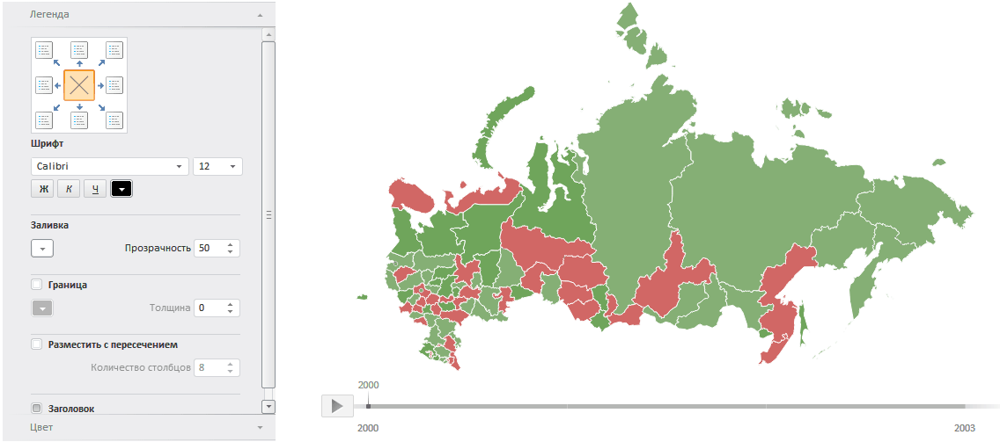

# Пример размещения компонентов MapMaster и MapChart

Пример размещения компонентов MapMaster и MapChart
-

# Пример размещения компонентов MapMaster и MapChart

Для выполнения примера необходимо создать html-страницу и выполнить
 следующие действия:

1. В теге HEAD добавьте ссылки на следующие js- и css-файлы: PP.css,
 PP.js, PP.MapMaster.js, PP.MapChart.js, resources.ru.js.

2. Добавьте ссылки на:

	- файл с топоосновой в формате SVG (напимер, Russia.svg);

	- [xml-файл](../MapChart/xml_specification/xml-specification.htm)
	 с настройками для карты (данные для настроек должны быть представлены
	 в формате [JSON](../MapChart/xml_and_json.htm));

3. В теге SCRIPT добавьте код для создания компонентов [MapMaster](MapMaster.htm)
 и [EaxMapBox](dhtmlExpress.chm::/Classes/Express/EaxMapBox/EaxMapBox.htm):

    //Создаем переменную, которая будет содержать карту
    var map, legend;
    function createMap(mapData) {
        PP.resourceManager.setRootResourcesFolder("../resources/"); //путь к папке с ресурсами
        if (map) map.dispose();
        var mapContent = document.getElementById("map-content");
        //получаем JSON-настройки карты
        var settings = JSON.parse(mapData);
        //определяем топооснову
        settings.MapChart.Topobase = "Topobase/SVG/Russia.svg";//Путь до топоосновы
        settings.MapChart.ParentNode = document.getElementById("Map");
        //путь к папке с картинками
        settings.MapChart.ImagePath = "build/img/";
        //создаем карту
        map = new PP.MapChart(settings.MapChart ? settings.MapChart : settings);
        master = new PP.Ui.MapMaster({
            ParentNode: "mapM", //DOM-вершина, в которой будет размещаться мастер диаграммы
            Height: 500,
            Width: 310,
            ImagePath: "build/img/",
            DataView: map
        });
        window.onresize();
    }
    //запрос для получения файла с JSON-настройками карты
    var Request = new PP.Ajax(
    {
        Url: "Json/MapXmlExample_RU.xml?d",//Путь до файла с настройками карты
        Success: function (sender, args) {
            createMap(args.ResponseText);
            Request.dispose();
        }
    });
    Request.send();
    //Функция для обновления размеров карты
    function updateSize() {
        if (map) {
            map.setHeight(document.documentElement.clientHeight - 60);
            map.setWidth(document.documentElement.clientWidth);
        }
    }
    var idTime;
    //функция для установки размеров карты в соответствии с размерами окна
    window.onresize = function () {
        if (idTime) clearTimeout(idTime);
        idTime = setTimeout(updateSize, 100);
    }

4. В теге BODY добавьте следующий код:

<body onselectstart="return false" class="PPNoSelect" onload="onReady()">
    <table style="width: 100%">
        <tr>
            <td valign="top" width="350" id="mapM">
            </td>
            <td valign="top" id="Map">
            </td>
        </tr>
    </table>
</body>
После выполнения примера на странице будет размещен компонент [MapChart](../MapChart/MapChart.htm)
 и [мастер](MapMaster.htm) для его настройки:

См. также:

[MapMaster](MapMaster.htm)
 | [MapChart](../MapChart/MapChart.htm)

		Справочная
		 система на версию 10.9
		 от 18/08/2025,
		 © ООО «ФОРСАЙТ»,
