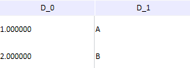
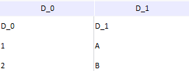

# DataImportService.setHasHeader

DataImportService.setHasHeader
-

# DataImportService.setHasHeader

## Синтаксис

setHasHeader (cubeImport, sourceType, hasHeader,
 callback, errorCallback)

## Параметры

cubeImport. Модель
 объекта импорта в куб, экземпляр класса [CubeImport](../CubeImport/CubeImport.htm);

sourceType.
 Тип источника. Допустимые значения: "Excel", "ExcelEx",
 "Text".

hasHeader. Определяет,
 рассматривается ли содержимое первой строки импортируемой таблицы как
 заголовки. Если установлено значение false, то содержимое первой строки не рассматривается
 как заголовки. По умолчанию установлено значение true.

callback. Функция обратного
 вызова.

errorCallback. Функция обратного
 вызова в случае ошибки.

## Описание

Метод setHasHeader oпределяет,
 рассматривается ли содержимое первой строки импортируемой таблицы как
 заголовки.

## Комментарии

Данный метод срабатывает при установке или снятии флага «Первая
 строка содержит заголовки» на [первой](../ImportColumnsStep/ImportColumnsStep.htm)
 и [второй](../SetValueColumnsStep/SetValueColumnsStep.htm)
 страницах [мастера импорта
 данных](../ImportDataWizard/ImportDataWizard.htm).

Первая строка содержит заголовки:

Первая строка не содержит заголовки:

## Пример

Пример использования метода приведен в описании события [DataImportService.GetFieldsCompleted](DataImportService.GetFieldsCompleted.htm).

См. также:

[DataImportService](DataImportService.htm)

		Справочная
		 система на версию 10.9
		 от 18/08/2025,
		 © ООО «ФОРСАЙТ»,
