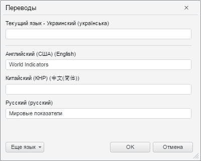

# TranslateDialog.CurrentLanguage

TranslateDialog.CurrentLanguage
-

# TranslateDialog.CurrentLanguage

## Синтаксис

CurrentLanguage: Number;

## Описание

Свойство CurrentLanguage определяет
 текущий язык.

## Комментарии

Значение свойства - [четырехзначный
 цифровой код языка](http://msdn.microsoft.com/en-us/goglobal/bb964664.aspx).

По умолчанию текущий язык соответствует текущим языковым настройкам,
 которые заданы при помощи метода [PP.setCurrentCulture](dhtmlCommon.chm::/Classes/PP/PP.setCurrentCulture.htm).

## Пример

Для выполнения примера предполагается наличие на *.html-странице компонента
 [TranslateDialog](../../../../Components/Metabase/Dialogs/TranslateDialog/TranslateDialog.htm)
 (см. «[Пример
 создания компонента TranslateDialog](../../../../Components/Metabase/Dialogs/TranslateDialog/TranslateDialog_example.htm)») с наименованием «translateDialog».
 Установим украинский язык в качестве текущего языка в диалоге «Переводы»:

translateDialog.setCurrentLanguage(1058);
После выполнения примера в качестве текущего языка в диалоге «Переводы»
 будет установлен украинский:

См. также:

[TranslateDialog](TranslateDialog.htm)

		Справочная
		 система на версию 10.9
		 от 18/08/2025,
		 © ООО «ФОРСАЙТ»,
