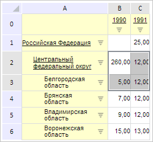
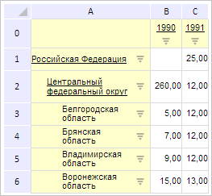

# PP.Mb.Ui.GridView.EditMode

PP.Mb.Ui.GridView.EditMode
-

**

# GridView.EditMode

## Синтаксис

EditMode: Boolean;

## Описание

Свойство EditMode определяет
 признак возможности редактирования таблицы.

## Комментарии

Значение свойства устанавливается из JSON и с помощью метода setEditMode,
 а возвращается с помощью метода getEditMode.**

**Если
 свойство имеет значение true, то редактирование возможно, иначе -
 нет.**

## Пример

Для выполнения примера необходимо наличие на html-странице компонента
 [ExpressBox](dhtmlExpress.chm::/Components/Express/ExpressBox/ExpressBox.htm)
 с наименованием «expressBox» (см. «[Пример
 создания компонента ExpressBox](dhtmlExpress.chm::/Components/Express/ExpressBox/ExpressBox_Example.htm)») и с загруженной таблицей
 в рабочей области экспресс-отчета. До выполнения примера таблица экспресс-отчета
 выглядит так, как показано на странице [описания
 класса GridView](GridView.htm).

Запретим редактирование таблицы, выведем идентификаторы репозитория и источника
 данных. Обработаем события изменения выделения ячеек и изменения значений
 свойств. Установим новое выделение ячеек таблицы:

// Получим таблицу экспресс-отчета
var grid = expressBox.getDataView().getGridView();
// Запретим редактировать таблицу
grid.setEditMode(false);
// Выведем идентификатор репозитория
console.log("Идентификатор репозитория: " + grid.getService().getMetabase().getId());
// Выведем идентификатор источника данных
console.log("Идентификатор источника данных: " + grid.getTableSource().getSource().getId());
// Обработаем событие SelectionChanged
grid.SelectionChanged.add(function (sender, args, timeout) {
    console.log("Инициировано событие SelectionChanged");
});
// Обработаем событие SelectionChanging
grid.SelectionChanging.add(function (sender, args, timeout) {
    console.log("Инициировано событие SelectionChanging");
});
// Обработаем событие PropertyChanged
grid.PropertyChanged.add(function (sender, args, timeout) {
    console.log("Инициировано событие PropertyChanged");
});
// Получим текущее выделение ячеек
var selection = grid.getSelection();
// Установим параметры выделения ячеек
selection.range.parts.it[0].left = 1;
selection.range.parts.it[0].top = 2;
selection.range.parts.it[0].width = 2;
selection.range.parts.it[0].height = 2;
// Установим новое выделение ячеек
grid.setSelection(selection);
// Обновим все элементы таблицы
grid.refreshAll();
В результате было запрещено редактирование таблицы и было изменено выделение
 ячеек:

Также в консоли браузера были выведены идентификаторы репозитория и источника
 данных, сообщения о вызове обработанных событий:

Идентификатор репозитория: WAREHOUSE

Идентификатор источника данных: GRIDVIEW

Инициировано событие SelectionChanging

Инициировано событие PropertyChanged

Инициировано событие SelectionChanged

Уберем выделение ячеек:

// Уберем выделение ячеек
grid.clearSelection();
В результате выделение ячеек было снято:

См. также:

[GridView](GridView.htm)

		Справочная
		 система на версию 10.9
		 от 18/08/2025,
		 © ООО «ФОРСАЙТ»,
