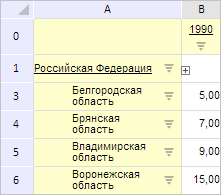

# PP.Mb.Ui.GridView.ExpanderAction

PP.Mb.Ui.GridView.ExpanderAction
-

**

# GridView.ExpanderAction

## Синтаксис

ExpanderAction: function(sender, args, timeout);

## Параметры

sender. Источник события;

args. Информация о событии.
 Доступные аргументы: IsCollapse - признак того, что группировка ячеек
 таблицы свёрнута, coord - координаты левой верхней ячейки в диапазоне
 сгрупированных ячеек, Expanders - JSON-объект с полем Expander, содержащим
 массив данных о всех диапазонах сгруппированных ячеек;

timeout. Промежуток времени
 в миллисекундах, через который вызовется событие.

## Описание

Событие ExpanderAction**
 наступает при разворачивании экспандера в таблице.

## Пример

Для выполнения примера необходимо наличие на html-странице компонента
 [ExpressBox](dhtmlExpress.chm::/Components/Express/ExpressBox/ExpressBox.htm)
 с наименованием «expressBox» (см. «[Пример
 создания компонента ExpressBox](dhtmlExpress.chm::/Components/Express/ExpressBox/ExpressBox_Example.htm)») и с загруженной таблицей
 в рабочей области экспресс-отчета. До выполнения примера таблица экспресс-отчета
 выглядит так, как показано на странице [описания
 класса GridView](GridView.htm).

Сгруппируем диапазон ячеек B1:C2 и обработаем событие ExpanderAction,
 выводя сообщения о том, сгруппирован или развёрнут данный диапазон:

// Получим таблицу экспресс-отчёта
var gridView = expressBox.getDataView().getGridView();
// Обработаем событие ExpanderAction
gridView.ExpanderAction.add(function (sender, args) {
    if (args.IsCollapse) {
        console.log("Группировка ячеек свёрнута");
    } else {
        console.log("Группировка ячеек развёрнута");
    }
});
// Получим таблицу
var tabSheet = gridView.getTabSheet();
// Получим диапазон ячеек по заданным координатам
var range = tabSheet.getRange(1, 2, 2, 1);
// Добавим экспандер по заданному диапазону
var expander = tabSheet.addExpander(range, false, false);
// Сгруппируем диапазон ячеек таблицы
expander.collapse();
В результате выполнения примера был сгруппирован диапазон ячеек B1:C2:

В результате обработки события ExpanderAction
 в консоли браузера было выведено сообщение о том, что группировка ячеек
 свёрнута.

См. также:

[GridView](GridView.htm)

		Справочная
		 система на версию 10.9
		 от 18/08/2025,
		 © ООО «ФОРСАЙТ»,
