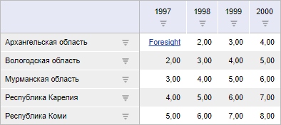

# PP.Mb.Ui.GridView.HyperlinkMouseDown

PP.Mb.Ui.GridView.HyperlinkMouseDown
-

**

# GridView.HyperlinkMouseDown

## Синтаксис

HyperlinkMouseDown: function(sender, args, timeout);

## Параметры

sender. Источник события;

args. Информация о событии.
 Доступные аргументы: rowIndex - индекс строки ячейки, в которой находится
 нажатая гиперссылка, colIndex - индекс столбца таблицы данной ячейки,
 hyperlink - объект гиперссылки со свойствами Action, ActionType, Color,
 Enable, Target, Text, Underline , event - событие нажатия курсора мыши
 на гиперссылку;

timeout. Промежуток времени
 в миллисекундах, через который вызовется событие.

## Описание

Событие HyperlinkMouseDown**
 наступает при нажатии на гиперссылку в таблице.

## Пример

Для выполнения примера необходимо наличие на html-странице компонента
 [ExpressBox](dhtmlExpress.chm::/Components/Express/ExpressBox/ExpressBox.htm)
 с наименованием «expressBox» (см. «[Пример
 создания компонента ExpressBox](dhtmlExpress.chm::/Components/Express/ExpressBox/ExpressBox_Example.htm)») и с загруженной таблицей
 в рабочей области экспресс-отчета. До выполнения примера таблица экспресс-отчета
 выглядит так, как показано на странице [описания
 класса GridView](GridView.htm).

Создадим гиперссылку, отобразим её в ячейках таблицы и обработаем событие
 нажатия на них HyperlinkMouseDown:

// Получим таблицу экспресс-отчёта
var gridView = expressBox.getDataView().getGridView();
// Получим таблицу
var tabSheet = gridView.getTabSheet();
// Получим ячейку с координатой (1, 1)
var cell = tabSheet.getCell(1, 1);
// Получим стиль ячеек
var style = cell.getStyle();
// Зададим цвет, доступность, стиль, текст, адрес гиперссылки
style.Hyperlink.Color = "#1A3DC1";
style.Hyperlink.Enable = true;
style.Hyperlink.Underline = true;
style.Hyperlink.Text = "Foresight";
style.Hyperlink.Action = "http://www.fsight.ru";
// Отобразим гиперссылку в ячейке
tabSheet.showHyperlinksOnRange([{
    type: PP.Ui.TabSheetHyperLinkShowType.All,
    range: tabSheet.getCell(1, 1)}
]);
// Перерисуем таблицу
tabSheet.resetRange(tabSheet.getCell(1, 1));
// Обработаем событие HyperlinkMouseDown
tabSheet.HyperlinkMouseDown.add(function (sender, eventArgs) {
    // Выведем информацию о гиперссылке
    coords = (eventArgs.rowIndex, eventArgs.colIndex);
    console.log("Координата ячейки с гиперссылкой: (" + eventArgs.rowIndex + "," + eventArgs.colIndex + ")");
    var hyperlink = eventArgs.hyperlink;
    console.log("Текст: " + hyperlink.Text);
    console.log("Цвет: " + hyperlink.Color);
    console.log("Адрес: " + hyperlink.Action);
});
В результате выполнения примера была создана и отображена гиперссылка
 в ячейке таблицы:

При нажатии на гиперссылку в ячейке таблицы будут выведены в консоль
 координаты этой ячейки, цвет, текст и адрес гиперссылки:

Координата ячейки с гиперссылкой: (1,1)

Текст: Foresight

Цвет: #1A3DC1

Адрес: http://www.fsight.ru

См. также:

[GridView](GridView.htm)

		Справочная
		 система на версию 10.9
		 от 18/08/2025,
		 © ООО «ФОРСАЙТ»,
