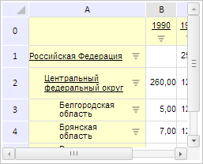
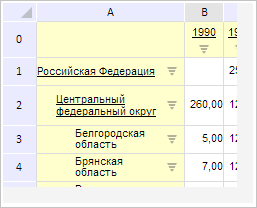

# PP.Mb.Ui.GridView.getFocusedCell

PP.Mb.Ui.GridView.getFocusedCell
-

# GridView.getFocusedCell

## Синтаксис

getFocusedCell();

## Описание

Метод getFocusedCell возвращает
 координаты ячейки таблицы с фокусом.

## Комментарии

Метод возвращает значение типа [PP.Ui.TabSheetCoord](dhtmlTabSheet.chm::/Classes/TabSheet/TabSheetCoord/TabSheetCoord.htm).

## Пример

Для выполнения примера необходимо наличие на html-странице компонента
 [ExpressBox](dhtmlExpress.chm::/Components/Express/ExpressBox/ExpressBox.htm)
 с наименованием «expressBox» (см. «[Пример
 создания компонента ExpressBox](dhtmlExpress.chm::/Components/Express/ExpressBox/ExpressBox_Example.htm)») и с загруженной таблицей
 в рабочей области экспресс-отчета. До выполнения примера таблица экспресс-отчета
 выглядит так, как показано на странице [описания
 класса GridView](GridView.htm).

Установим новое значение ширины и высоты таблицы и обновим её. Выведем
 координаты текущей ячейки с фокусом, количество строк в таблице и текущий
 тип выделения в таблице:

// Получим таблицу экспресс-отчета
var grid = expressBox.getDataView().getGridView();
// Установим новые значения ширины и высоты таблицы
grid.setWidth(250);
grid.setHeight(200);
// Обновим таблицу
grid.refresh(new PP.Mb.Ui.PropertyChangedEventArgs({
    PropertyName: PP.Exp.Ui.ControlType.DataView,
    TypeUpdateData: PP.Exp.Ui.ViewTypeUpdate.Table
}));
// Получим координаты ячейки с фокусом
var focusedCell = grid.getFocusedCell();
console.log("Координаты ячейки с фокусом: [" + focusedCell.rowIndex + ", " + focusedCell.colIndex + "]");
// Получим количество строк в таблице
console.log("Количество строк в таблице: " + grid.getRowsCount());
// Получим текущий тип выделения в таблице
console.log("Текущий тип выделения в таблице: " + grid.getSelectionType());
В результате были изменены размеры таблицы и были отображены полосы
 прокрутки:

Также в консоли браузера были выведены координаты ячейки с фокусом,
 количество строк в таблице и текущий тип выделения в таблице:

Координаты ячейки с фокусом: [6, 1]

Количество строк в таблице: 7

Текущий тип выделения в таблице: Cell

Скроем горизонтальную и вертикальную полосы прокрутки:

// Скроем горизонтальную и вертикальную полосы прокрутки
grid.setScroll(PP.Exp.Ui.TableEnum.HScroll, false);
grid.setScroll(PP.Exp.Ui.TableEnum.VScroll, false);
В результате были скрыты полосы прокрутки:

См. также:

[GridView](GridView.htm)

		Справочная
		 система на версию 10.9
		 от 18/08/2025,
		 © ООО «ФОРСАЙТ»,
