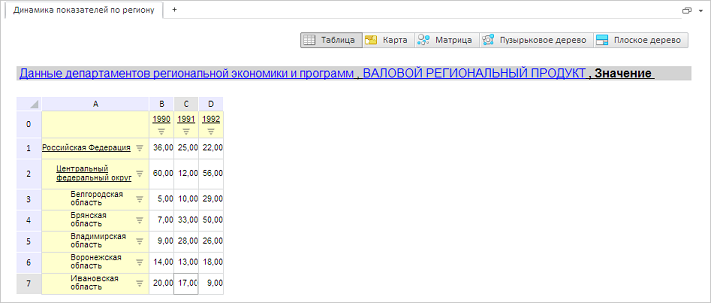

# GxTitle.BackgroundColor

GxTitle.BackgroundColor
-

# GxTitle.BackgroundColor

## Синтаксис

BackgroundColor: PP.[Color](dhtmlCommon.chm::/Classes/PP/Color/Color.htm)
 || RGB || String

## Описание

Свойство BackgroundColor определяет
 цвет фона заголовка экспресс-отчета.

## Комментарии

Значение свойства устанавливается из JSON и с помощью метода setBackgroundColor,
 а возвращается с помощью метода getBackgroundColor.

## Пример

Для выполнения примера необходимо наличие на html-странице компонента
 [ExpressBox](dhtmlExpress.chm::/Components/Express/ExpressBox/ExpressBox.htm)
 с наименованием «expressBox» (см. «[Пример
 создания компонента ExpressBox](dhtmlExpress.chm::/components/express/expressbox/expressbox_example.htm)»). Для появления заголовка необходимо
 нажать на кнопку «Заголовок» на вкладке «Главная». Изменим цвет фона заголовка:

// Получаем заголовок
var title = expressBox.getDataView().getTitleView();
// Меняем цвет заголовка
title.setBackgroundColor(PP.Color.Colors.lightgray);
В результате для заголовка экспресс-отчета будет установлен новый цвет:

См. также:

[GxTitle](GxTitle.htm)

		Справочная
		 система на версию 10.9
		 от 18/08/2025,
		 © ООО «ФОРСАЙТ»,
