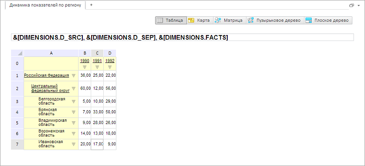

# GxTitle.EnableEdit

GxTitle.EnableEdit
-

# GxTitle.EnableEdit

## Синтаксис

EnableEdit: Boolean

## Описание

Свойство EnableEdit определяет
 возможность редактирования заголовка.

## Комментарии

Допустимые значения:

	- true.
	 Редактирование заголовка разрешено (по умолчанию);

	- false.
	 Редактирование заголовка запрещено.

Значение свойства устанавливается из JSON и с помощью метода setEnableEdit,
 а возвращается с помощью метода getEnableEdit.

## Пример

Для выполнения примера необходимо наличие на html-странице компонента
 [ExpressBox](dhtmlExpress.chm::/Components/Express/ExpressBox/ExpressBox.htm)
 с наименованием «expressBox» (см. «[Пример
 создания компонента ExpressBox](dhtmlExpress.chm::/Components/Express/ExpressBox/ExpressBox_Example.htm)»). Для появления заголовка необходимо
 нажать на кнопку «Заголовок» на вкладке «Главная». Проверим, включен ли
 режим редактирования, и разрешим редактирование заголовка, также установим
 обработчики событий [EditModeChanged](GxTitle.EditModeChanged.htm)
 и [TextSelectionChanged](GxTitle.TextSelectionChanged.htm):

// Получаем заголовок
var title = expressBox.getDataView().getTitleView();
// Проверяем, включен ли режим редактирования
if (title.getEditMode()) {
    console.log("Режим редактирования включен");
} else {
    console.log("Режим редактирования не включен");
}
// Устанавливаем обработчик события EditModeChanged
title.EditModeChanged.add(function(sender, args) {
    console.log("Изменился режим редактирования");
});
// Устанавливаем обработчик события TextSelectionChanged
title.TextSelectionChanged.addfunction(sender, args) {
    console.log("Изменился текст редактора заголовка");
});
// Разрешаем редактирование заголовка
title.setEnableEdit(true);
В консоль будет выведен результат проверки:

Режим редактирования не включен

Запускаем режим редактирования и меняем высоту текстового редактора
 заголовка:

// Запускаем режим редактирования
title.beginEdit();
// Меняем высоту текстового редактора
title.getTextEditor().setHeight(20);
В результате появится возможность редактировать заголовок:

 

В консоль будет выведена информация о изменении режима редактирования:

Изменился режим редактирования

После изменения текста редактора в консоль будет выведена информация
 об изменении:

Изменился текст редактора заголовка

Выключаем режим редактирования заголовка:

// Выключаем режим редактирования
title.endEdit();
См. также:

[GxTitle](GxTitle.htm)

		Справочная
		 система на версию 10.9
		 от 18/08/2025,
		 © ООО «ФОРСАЙТ»,
