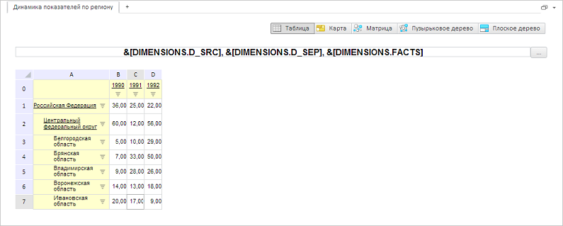

# GxTitle.IsMultiLanguage

GxTitle.IsMultiLanguage
-

# GxTitle.IsMultiLanguage

## Синтаксис

IsMultiLanguage: Boolean

## Описание

Свойство IsMultiLanguage управляет
 видимостью кнопки вызова диалога для перевода текста заголовка во время
 редактирования.

## Комментарии

Режим редактирования включается с помощью метода [beginEdit](GxTitle.beginEdit.htm)
 и определяется видимость кнопки вызова диалога для перевода текста.

Допустимые значения:

	- true.
	 Отображается кнопка вызова диалога;

Примечание.
 Кнопка будет отображаться в том случае, если у объекта Source ([PP.Exp.EaxAnalyzer](dhtmlExpress.chm::/Classes/Express/EaxAnalyzer/EaxAnalyzer.htm))
 класса [PP.Exp.Ui.ExpressBox](dhtmlExpress.chm::/Classes/Express/ExpressBox/ExpressBox.htm)
 также установлено свойство IsMultiLanguage = true.

	- false.
	 Скрыта кнопка вызова диалога (по умолчанию).

Значение свойства устанавливается из JSON и с помощью метода setIsMultiLanguage,
 а возвращается с помощью метода getIsMultiLanguage.

## Пример

Для выполнения примера необходимо наличие на html-странице компонента
 [ExpressBox](dhtmlExpress.chm::/Components/Express/ExpressBox/ExpressBox.htm)
 с наименованием «expressBox» (см. «[Пример
 создания компонента ExpressBox](dhtmlExpress.chm::/Components/Express/ExpressBox/ExpressBox_Example.htm)»). Для появления заголовка
 необходимо нажать на кнопку «Заголовок» на вкладке «Главная». Отобразим
 кнопку вызова диалога для перевода текста:

// Получаем заголовок
var title = expressBox.getDataView().getTitleView();
// Включаем отображение кнопки вызова диалога для перевод текста заголовка
title.getSource().setIsMultiLanguage(true)
// Включаем редактирование заголовка
title.beginEdit();
В результате в редакторе заголовка появится кнопка вызова диалога для
 перевода:

См. также:

[GxTitle](GxTitle.htm)

		Справочная
		 система на версию 10.9
		 от 18/08/2025,
		 © ООО «ФОРСАЙТ»,
