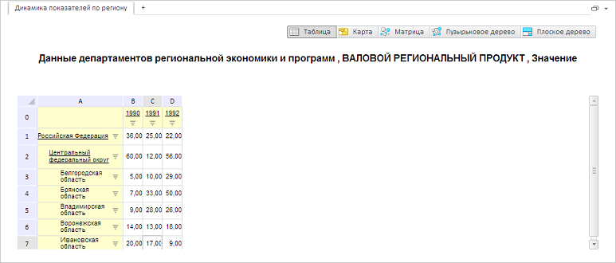

# GxTitle.Size

GxTitle.Size
-

# GxTitle.Size

## Синтаксис

Size: Object

## Описание

Свойство Size определяет размер
 заголовка экспресс-отчета.

## Комментарии

Значение свойства устанавливается с помощью метода setSize,
 а возвращается с помощью метода getSize.

## Пример

Для выполнения примера необходимо наличие на html-странице компонента
 [ExpressBox](dhtmlExpress.chm::/Components/Express/ExpressBox/ExpressBox.htm)
 с наименованием «expressBox» (см. «[Пример
 создания компонента ExpressBox](dhtmlExpress.chm::/Components/Express/ExpressBox/ExpressBox_Example.htm)»). Для появления заголовка необходимо
 нажать на кнопку «Заголовок» на вкладке «Главная». Установим новый размер
 заголовка:

// Получаем заголовок
var title = expressBox.getDataView().getTitleView();
// Устанавливаем новый размер заголовка
title.setSize({
    Height: 40,
    Width: 100
});
// Обновляем содержимое заголовка
title.updateContent();
В результате заголовок будет иметь новый размер:

См. также:

[GxTitle](GxTitle.htm)

		Справочная
		 система на версию 10.9
		 от 18/08/2025,
		 © ООО «ФОРСАЙТ»,
