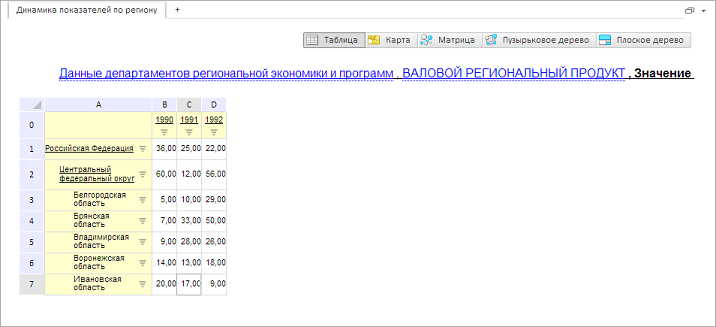

# GxTitle.TextAlignment

GxTitle.TextAlignment
-

# GxTitle.TextAlignment

## Синтаксис

TextAlignment: String

## Описание

Свойство TextAlignment определяет
 выравнивание текста заголовка по горизонтали.

## Комментарии

Допустимые значения:

		 Значение

		 Краткое
		 описание

		 Left

		 Выравнивание слева от центра.

		 Right

		 Выравнивание справа от центра.

Значение свойства устанавливается из JSON и с помощью метода setTextAlignment,
 а возвращается с помощью метода getTextAlignment.

## Пример

Для выполнения примера необходимо наличие на html-странице компонента
 [ExpressBox](dhtmlExpress.chm::/Components/Express/ExpressBox/ExpressBox.htm)
 с наименованием «expressBox» (см. «[Пример
 создания компонента ExpressBox](dhtmlExpress.chm::/Components/Express/ExpressBox/ExpressBox_Example.htm)»). Для появления заголовка
 необходимо нажать на кнопку «Заголовок» на вкладке «Главная». Установим
 выравнивание заголовка по правому краю:

// Получаем заголовок
var title = expressBox.getDataView().getTitleView();
// Устанавливаем выравнивание заголовка по правому краю
title.setTextAlignment("right");
В результате заголовок будет выравнен по правому краю:

См. также:

[GxTitle](GxTitle.htm)

		Справочная
		 система на версию 10.9
		 от 18/08/2025,
		 © ООО «ФОРСАЙТ»,
