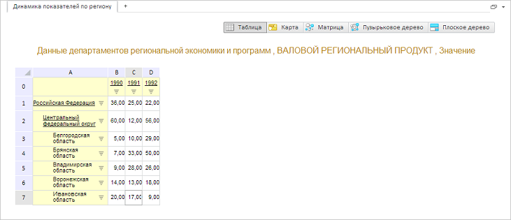

# GxTitle.TextColor

GxTitle.TextColor
-

# GxTitle.TextColor

## Синтаксис

TextColor: PP.[Color](dhtmlCommon.chm::/Classes/PP/Color/Color.htm)
 || RGB || String

## Описание

Свойство TextColor определяет
 цвет текста заголовка.

## Комментарии

Значение свойства устанавливается из JSON и с помощью метода setTextColor,
 а возвращается с помощью метода getTextColor.

## Пример

Для выполнения примера необходимо наличие на html-странице компонента
 [ExpressBox](dhtmlExpress.chm::/Components/Express/ExpressBox/ExpressBox.htm)
 с наименованием «expressBox» (см. «[Пример
 создания компонента ExpressBox](dhtmlExpress.chm::/components/express/expressbox/expressbox_example.htm)»). Для появления заголовка необходимо
 нажать на кнопку «Заголовок» на вкладке «Главная». Изменим цвет текста
 заголовка:

// Получаем заголовок
var title = expressBox.getDataView().getTitleView();
// Меняем цвет текста заголовка
title.setTextColor(PP.Color.Colors.darkgoldenrod);
В результате будет изменен цвет заголовка:

См. также:

[GxTitle](GxTitle.htm)

		Справочная
		 система на версию 10.9
		 от 18/08/2025,
		 © ООО «ФОРСАЙТ»,
