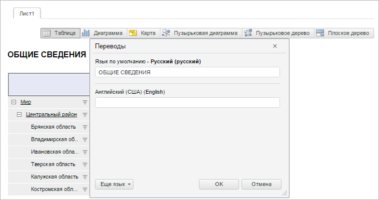

# GxTitle.getTranslateDialog

GxTitle.getTranslateDialog
-

# GxTitle.getTranslateDialog

## Синтаксис

getTranslateDialog();

## Описание

Метод getTranslateDialog возвращает
 диалог для перевода текста заголовка.

## Комментарии

Возвращаемое значение - экземпляр класса [PP.Mb.Ui.TranslateDialog](../Dialogs/TranslateDialog/TranslateDialog.htm).

## Пример

Для выполнения примера необходимо наличие на html-странице компонента
 [ExpressBox](dhtmlExpress.chm::/Components/Express/ExpressBox/ExpressBox.htm)
 с наименованием «expressBox» (см. «[Пример
 создания компонента ExpressBox](dhtmlExpress.chm::/Components/Express/ExpressBox/ExpressBox_Example.htm)»). Для появления заголовка
 необходимо нажать на кнопку «Заголовок» на вкладке «Главная». Отобразим диалог
 для перевода текста заголовка:

// Получаем заголовок
var title = expressBox.getDataView().getTitleView();
// Задаем активность окна
title.getTranslateDialog().setEnabled(true);
// Отображаем диалог для перевода текста
title.getTranslateDialog().show();
В результате будет отображен диалог для перевода текста заголовка:

См. также:

[GxTitle](GxTitle.htm)

		Справочная
		 система на версию 10.9
		 от 18/08/2025,
		 © ООО «ФОРСАЙТ»,
