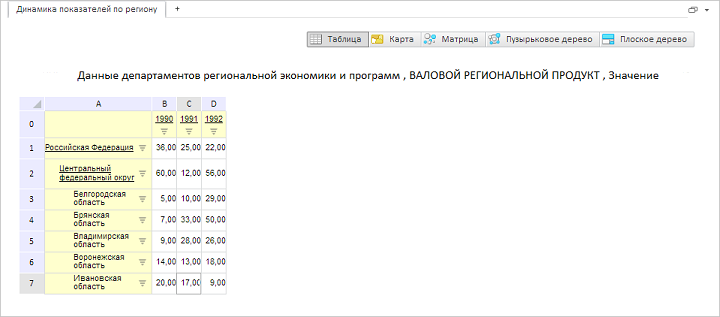

# GxTitle.setFontFamily

GxTitle.setFontFamily
-

# GxTitle.setFontFamily

## Синтаксис

setFontFamily(value: [PP.Font.Family](dhtmlCommon.chm::/enums/font.family.htm)
 || String);

## Параметры

value. Устанавливаемое наименование
 шрифта.

## Описание

Метод setFontFamily устанавливает
 наименование шрифта заголовка.

## Пример

Для выполнения примера необходимо наличие на html-странице компонента
 [ExpressBox](dhtmlExpress.chm::/Components/Express/ExpressBox/ExpressBox.htm)
 с наименованием «expressBox» (см. «[Пример
 создания компонента ExpressBox](dhtmlExpress.chm::/Components/Express/ExpressBox/ExpressBox_Example.htm)»). Для появления заголовка необходимо
 нажать на кнопку «Заголовок» на вкладке «Главная». Изменим шрифт заголовка:

// Получаем заголовок
var title = expressBox.getDataView().getTitleView();
// Меняем шрифт заголовка
title setFontFamily(PP.Font.Family.Calibri);
В результате тексту заголовка будет установлен новый шрифт:

См. также:

[GxTitle](GxTitle.htm)

		Справочная
		 система на версию 10.9
		 от 18/08/2025,
		 © ООО «ФОРСАЙТ»,
