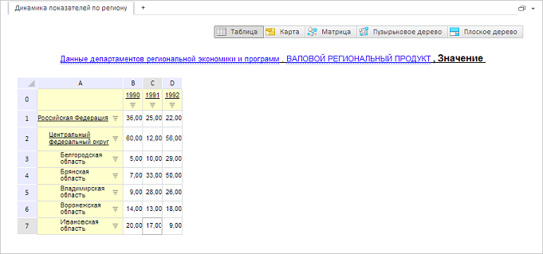

# GxTitle.setFontSize

GxTitle.setFontSize
-

# GxTitle.setFontSize

## Синтаксис

setFontSize(value: Number);

## Параметры

value. Устанавливаемый размер текста.

## Описание

Метод setFontSize устанавливает
 размер шрифта текста заголовка.

## Пример

Для выполнения примера необходимо наличие на html-странице компонента
 [ExpressBox](dhtmlExpress.chm::/Components/Express/ExpressBox/ExpressBox.htm)
 с наименованием «expressBox» (см. «[Пример
 создания компонента ExpressBox](dhtmlExpress.chm::/Components/Express/ExpressBox/ExpressBox_Example.htm)»). Для появления заголовка необходимо
 нажать на кнопку «Заголовок» на вкладке «Главная». Установим тексту заголовка
 новый размер:

// Получаем заголовок
var title = expressBox.getDataView().getTitleView();
// Устанавливаем тексту заголовка новый размер
title.setFontSize(10);
В результате тексту заголовка будет установлен новый размер:

См. также:

[GxTitle](GxTitle.htm)

		Справочная
		 система на версию 10.9
		 от 18/08/2025,
		 © ООО «ФОРСАЙТ»,
